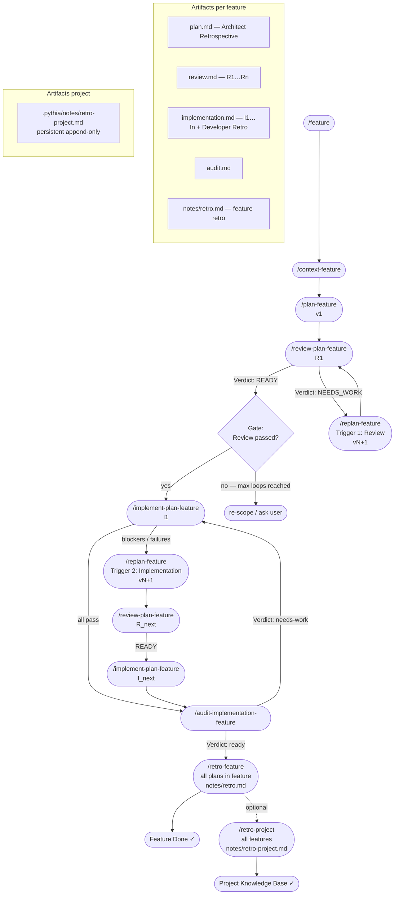

**Note**: Cursor Skills provide one slash command per skill (`/architecture-workflow`). Individual commands (`/plan-feature`, `/review-plan-feature`, etc.) remain in `.cursor/commands/` directory. This skill contains procedures, formats, and workflow logic referenced by commands.

**Context Budget**: Skill descriptions have 2% context window budget (fallback 16,000 chars). Keep detailed procedures in `references/` directory within skill, not in main SKILL.md.

# Architecture Workflow Skill

## Overview

This skill provides procedures and formats for the plan stabilization workflow. Commands are defined in `.cursor/commands/` and reference this skill for detailed procedures.

## Commands Reference

Commands are located in `.cursor/commands/`:

- `/feature` → `.cursor/commands/feature.md`
- `/context-feature` → `.cursor/commands/context-feature.md`
- `/plan-feature` → `.cursor/commands/plan-feature.md`
- `/review-plan-feature` → `.cursor/commands/review-plan-feature.md`
- `/replan-feature` → `.cursor/commands/replan-feature.md`
- `/implement-plan-feature` → `.cursor/commands/implement-plan-feature.md` (with gate logic)
- `/audit-implementation-feature` → `.cursor/commands/audit-implementation-feature.md`
- `/retro-feature` → `.cursor/commands/retro-feature.md` — feature-level: all plans in a feature
- `/retro-project` → `.cursor/commands/retro-project.md` — project-level: all features consolidated

## Workflow Procedures

### Feature Creation

- Input: Feature requirements, scope, objectives
- Output: Feature document in `feat-XXX/feat-XXX.md`
- Format: See feature template structure

### Context Creation

- Input: Feature context + context topic/type
- Output: Context document in `feat-XXX/contexts/{name}.context.md`
- Format: See context template structure

### Plan Creation/Revision

- Input: Feature context + plan slug (required) + optional review text or link to round
- Output: Full plan document with Plan-Id, Plan-Version, Plan revision log
- Format: See `references/plan-format.md`

### Review Process

- Input: Feature context + plan slug
- Output: Review document with Verdict, Step-by-Step Analysis
- Format: See `references/review-format.md`
- Max rounds: 2 (MAX_REVIEW_LOOPS)

### Implementation

- Gate: Check review file exists and Verdict is READY
- Input: Feature context + plan slug (after review pass)
- Output: Implementation report
- Format: See `references/implementation-format.md`

### Audit

- Input: Feature context + plan slug + implementation report
- Output: Architect audit report + plan update + feature document update (if verdict is "ready")
- Format: See `references/audit-format.md`
- **Plan Update**: If verdict is "ready", update plan:
  - Change Status to "Implemented"
  - Add `**Status**: done` to completed Steps
  - Mark acceptance criteria checkboxes as `[x]` for met criteria
- **Feature Document Update**: If verdict is "ready", update feature document:
  - Add/update plan entry in "Existing External Plans" section
  - Add `**Status: Implemented**` marker to plan entry

### Feature Retrospective

- Input: Feature directory path (no gate — works on in-progress or completed features)
- Scope: **all plans** within the feature
- Output: `{feature-dir}/notes/retro.md` — unified retro across all plans
- Collects: all `## Architect Retrospective` blocks from plans, all `### Developer Retrospective` blocks from implementation reports, chat context, skills analysis
- Synthesizes: cross-plan patterns, risk register (predicted vs materialized), knowledge base, recommendations

### Project Retrospective

- Input: Optional list of FEATURE_IDs (default: all features)
- Scope: **all features** in `.pythia/workflows/features/`
- Output: `.pythia/notes/retro-project.md` — single persistent file, new run block appended each time
- Sources: uses existing `notes/retro.md` per feature if available; otherwise collects raw
- Synthesizes: cross-feature patterns, codebase knowledge base, process improvement register, project-level risk register

## Workflow Diagram

## Review Loop Policy

- **MAX_REVIEW_LOOPS = 2** (recommended 2–3 rounds per Plan 1)
- If after max cycles there are Impact: high findings → stop: re-scope / ask user / re-plan
- Loop: /replan-feature → /review-plan-feature (max 2 cycles)

## Feature Binding

All artifacts are hermetic per feature:

- Plans: `feat-XXX/plans/{plan-slug}.plan.md`
- Reviews: `feat-XXX/reports/{plan-slug}.review.md`
- Implementation: `feat-XXX/reports/{plan-slug}.implementation.md`
- Audit: `feat-XXX/reports/{plan-slug}.audit.md`

Plan slug identifies the plan within a feature. All related artifacts use the same plan slug.
