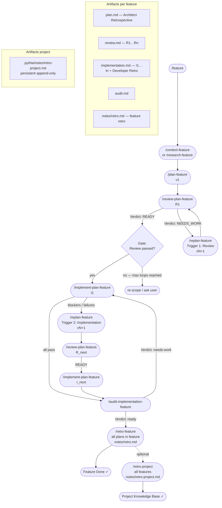

**Note**: Cursor Skills provide one slash command per skill (`/architecture-workflow`). Individual commands (`/plan-feature`, `/review-plan-feature`, etc.) remain in `.cursor/commands/` directory. This skill contains procedures, formats, and workflow logic referenced by commands.

**Context Budget**: Skill descriptions have 2% context window budget (fallback 16,000 chars). Keep detailed procedures in `references/` directory within skill, not in main SKILL.md.

# Architecture Workflow Skill

## Overview

This skill provides procedures and formats for the plan stabilization workflow. Commands are defined in `.cursor/commands/` and reference this skill for detailed procedures.

## Commands Reference

Commands: **Cursor** `.cursor/commands/`, **Claude** `.claude/commands/` (same names).

- `/feature` → `feature.md`
- `/context-feature` → `context-feature.md` — context creation for feature; for research-type context, delegate to Researcher or tell user to run `/researcher` or `/research-feature`
- `/research-feature` → `research-feature.md` — research **per feature**: pre-search pythia docs first (scattered), then Researcher → context doc in `feat-XXX/contexts/`
- `/researcher` → `researcher.md` — invoke Researcher subagent (research → context doc in feature/project)
- `/plan-feature` → `plan-feature.md`
- `/review-plan-feature` → `review-plan-feature.md`
- `/replan-feature` → `replan-feature.md`
- `/implement-plan-feature` → `implement-plan-feature.md` (with gate logic)
- `/audit-implementation-feature` → `audit-implementation-feature.md`
- `/retro-feature` → `retro-feature.md` — feature-level: all plans in a feature
- `/retro-project` → `retro-project.md` — project-level: all features consolidated

## Workflow Procedures

### Feature Creation

- Input: Feature requirements, scope, objectives
- Output: Feature document in `feat-XXX/feat-XXX.md`
- Format: See feature template structure

### Context Creation

- Input: Feature context + context topic/type
- Output: Context document in `feat-XXX/contexts/{name}.context.md`
- Format: See context template structure

### Research (Researcher subagent)

- **Purpose**: Broad and deep research on problems, solution options, best practices, 3rd party solutions. Output = context document in feature or project.
- **Command per feature**: `/research-feature` — run research for a feature; **pre-search** across all pythia/project docs first (`.pythia/workflows/features/`, `.pythia/contexts/`, `.pythia/notes/`, feature dirs — docs are scattered), then full research procedure; output in `feat-XXX/contexts/{topic}.context.md`. Also `/researcher` for ad-hoc invoke.
- **Pre-search (mandatory)**: Before external/codebase search, search pythia and project documents (semantic search / grep) for the topic; use findings to ground research and avoid duplication. See `references/research-procedure.md` step 0.
- **Procedure**: See `references/research-procedure.md`. When researching agent skills/tooling, use `.agents/skills/skill-search-and-fit/SKILL.md` (catalogs: Cursor, Skills.sh, AgentSkills.io, GitHub).

### Plan Creation/Revision

- Input: Feature context + plan slug (required) + optional review text or link to round
- Output: Full plan document with Plan-Id, Plan-Version, Plan revision log
- Format: See `references/plan-format.md`

### Review Process

- Input: Feature context + plan slug
- Output: Review document with Verdict, Step-by-Step Analysis
- Format: See `references/review-format.md`
- Max rounds: 2 (MAX_REVIEW_LOOPS)
- Review depth is adaptive within `/review-plan-feature` (Deep mode for R1 and major architect-driven vector/structural changes)
- **Delegation**: Review runs only in Reviewer subagent context (see Delegation policy below); when triggered automatically (e.g. after `/replan-feature`), the caller must launch the subagent and must not run review in the current context.

### Implementation

- Gate: Check review file exists and Verdict is READY
- Input: Feature context + plan slug (after review pass)
- Output: Implementation report
- Format: See `references/implementation-format.md`
- **Modes**: Plan execution (new Implementation Round I{n}; **one implementation round per plan version** — each v{N} at most once; plan version can be e.g. v12, v5) or **refinement** (user-requested bug fixes / follow-up; progress in last round's Out-of-Plan Work only, no new round).

### Audit

- Input: Feature context + plan slug + implementation report
- Output: Architect audit report + plan update + feature document update (if verdict is "ready")
- Format: See `references/audit-format.md`
- **Plan Update**: If verdict is "ready", update plan:
  - Change Status to "Implemented"
  - Add `**Status**: done` to completed Steps
  - Mark acceptance criteria checkboxes as `[x]` for met criteria
- **Feature Document Update**: If verdict is "ready", update feature document:
  - Add/update plan entry in "Existing External Plans" section
  - Add `**Status: Implemented**` marker to plan entry

### Feature Retrospective

- Input: Feature directory path (no gate — works on in-progress or completed features)
- Scope: **all plans** within the feature
- Output: `{feature-dir}/notes/retro.md` — unified retro across all plans
- Collects: all `## Architect Retrospective` blocks from plans, all `### Developer Retrospective` blocks from implementation reports, chat context, skills analysis
- Synthesizes: cross-plan patterns, risk register (predicted vs materialized), knowledge base, recommendations

### Project Retrospective

- Input: Optional list of FEATURE_IDs (default: all features)
- Scope: **all features** in `.pythia/workflows/features/`
- Output: `.pythia/notes/retro-project.md` — single persistent file, new run block appended each time
- Sources: uses existing `notes/retro.md` per feature if available; otherwise collects raw
- Synthesizes: cross-feature patterns, codebase knowledge base, process improvement register, project-level risk register

## Workflow Diagram

```mermaid
flowchart TD
    A([/feature]) --> B([/context-feature\nor /research-feature])
    B --> C([/plan-feature\nv1])

    C --> D([/review-plan-feature\nR1])

    D -->|Verdict: READY| E{Gate:\nReview passed?}
    D -->|Verdict: NEEDS_WORK| F([/replan-feature\nTrigger 1: Review\nvN+1])
    F --> D

    E -->|yes| G([/implement-plan-feature\nI1])
    E -->|no — max loops reached| Z([re-scope / ask user])

    G -->|all pass| H([/audit-implementation-feature])
    G -->|blockers / failures| I([/replan-feature\nTrigger 2: Implementation\nvN+1])
    I --> D2([/review-plan-feature\nR_next])
    D2 -->|READY| G2([/implement-plan-feature\nI_next])
    G2 --> H

    H -->|Verdict: ready| J([/retro-feature\nall plans in feature\nnotes/retro.md])
    H -->|Verdict: needs-work| G

    J --> K([Feature Done ✓])
    J -.->|optional| L([/retro-project\nall features\nnotes/retro-project.md])
    L --> M([Project Knowledge Base ✓])

    subgraph Artifacts per feature
        P1[plan.md — Architect Retrospective]
        P2[review.md — R1…Rn]
        P3[implementation.md — I1…In + Developer Retro]
        P4[audit.md]
        P5[notes/retro.md — feature retro]
    end

    subgraph Artifacts project
        Q1[.pythia/notes/retro-project.md\npersistent append-only]
    end
```

## Delegation policy (automatic follow-ups)

Any step that is triggered automatically by another command (e.g. review after replan) **must** be run by **launching the corresponding subagent** in a separate context. It must **not** be executed in the current agent’s context.

- **Rationale**: Role isolation — the follow-up role (e.g. Reviewer) has different constraints and context; running it in the caller’s context bypasses that isolation and can mix roles.
- **Consequence**: If the subagent cannot be launched, the triggering command must not perform the follow-up (fail fast with a clear message); it must not fall back to running the follow-up in the current context.

## Review Loop Policy

- **MAX_REVIEW_LOOPS = 2** (recommended 2–3 rounds per Plan 1)
- If after max cycles there are Impact: high findings → stop: re-scope / ask user / re-plan
- Loop: /replan-feature → /review-plan-feature (max 2 cycles); the review leg runs only via Reviewer subagent (Delegation policy).

## Feature Binding

All artifacts are hermetic per feature:

- Plans: `feat-XXX/plans/{plan-slug}.plan.md`
- Reviews: `feat-XXX/reports/{plan-slug}.review.md`
- Implementation: `feat-XXX/reports/{plan-slug}.implementation.md`
- Audit: `feat-XXX/reports/{plan-slug}.audit.md`

Plan slug identifies the plan within a feature. All related artifacts use the same plan slug.
