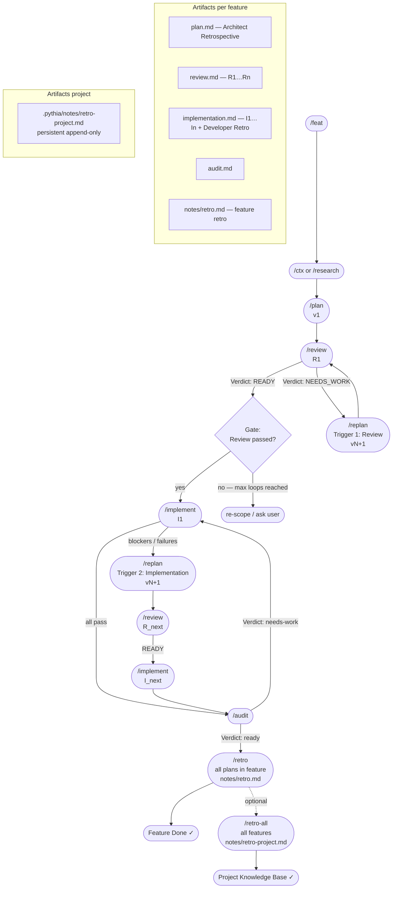

# Feature Workflow Skill

Master skill for feature development workflow. All steps below have dedicated skilluploads.

## Skilluploads Reference

**Feature Lifecycle**:

1. **[/feat](../feat/SKILL.md)** — Create comprehensive feature documents (2-stage: PM + Architect)
2. **[/plan](../plan/SKILL.md)** — Create/update feature plans (Architect)
3. **[/review](../review/SKILL.md)** — Review plans for architecture quality (Reviewer)
4. **[/replan](../replan/SKILL.md)** — Revise plans based on findings (Architect)
5. **[/implement](../implement/SKILL.md)** — Execute plan step-by-step (Developer)
6. **[/audit](../audit/SKILL.md)** — Verify implementation vs plan (Architect)
7. **[/loop](../loop/SKILL.md)** — Orchestrate full cycle auto-detection & routing

**Context & Research**:

- **[/research](../research/SKILL.md)** — Research for feature (Researcher) → context document
- **[/ctx](../ctx/SKILL.md)** — Create context documents for features (Architect)

**Retrospectives**:

- **[/retro](../retro/SKILL.md)** — Feature-level retrospective (Architect)
- **[/retro-all](../retro-all/SKILL.md)** — Project-level retrospective (Architect)

## Workflow Procedures

### Typical Feature Workflow

```
1. /feat                → Create feature document (PM + Architect)
2. /plan                → Create first plan (Architect)
3. /review              → Review plan (Reviewer)
   - If READY           → proceed
   - If NEEDS_REVISION  → /replan
4. /implement           → Execute plan (Developer)
5. /audit               → Verify implementation (Architect)
   - If ready           → DONE
   - If needs-fixes     → Developer fixes + re-audit
   - If plan-fix        → Architect patches plan + re-implement + re-audit
   - If re-plan         → Use /replan for scope decisions
```

### Orchestrated Loop

Use **[/loop](../loop/SKILL.md)** to auto-detect state and orchestrate full cycle in one call:

```
/loop [feature-id] [plan-slug]
```

Orchestrator detects artifact state and auto-routes:

- No plan → error (use /plan)
- No review → spawn Reviewer
- No implementation → spawn Developer
- No audit → spawn Architect
- Verdict routes to fix/replan/done

### Research-Driven Context

Use **[/research](../research/SKILL.md)** for exploring options, best practices, 3rd party solutions:

```
/research [feature-id] [research-topic]
```

Output: Context document in `feat-XXX/contexts/{topic}.context.md`

### Feature Analysis

Feature retrospectives synthesize learnings:

- **[/retro](../retro/SKILL.md)** → Feature-level: all plans/reviews/implementations
- **[/retro-all](../retro-all/SKILL.md)** → Project-level: cross-feature patterns

## Artifact Structure

Each feature lives in:

```
.pythia/workflows/features/
└── feat-YYYY-MM-{slug}/
    ├── feat-YYYY-MM-{slug}.md          # Feature document
    ├── plans/
    │   ├── 1-{plan-slug}.plan.md
    │   ├── 2-{plan-slug}.plan.md       # (after replan)
    │   └── ...
    ├── reports/
    │   ├── 1-{plan-slug}.review.md     # One per plan version
    │   ├── 1-{plan-slug}.implementation.md
    │   ├── 1-{plan-slug}.audit.md
    │   └── ...
    ├── contexts/
    │   ├── technical-analysis.context.md
    │   ├── architecture-decisions.context.md
    │   └── ...
    └── notes/
        ├── {plan-slug}.retro.md        # Feature retrospective
        └── {plan-slug}.problems.md     # Audit findings (if verdict ≠ ready)
```

## Procedures Reference

Detailed procedures and formats in `references/` subdirectory:

- `plan-format.md` — Plan document structure and requirements
- `review-format.md` — Review report structure
- `audit-format.md` — Audit report structure
- `implementation-format.md` — Implementation report structure
- `response-formats.md` — Structured chat response formats for each role
- `planning-methodology.md` — Planning principles and methodology
- `plan-review-framework.md` — Architecture review framework
- `research-procedure.md` — Research procedure for Researcher subagent
- `implementation-quality-guidelines.md` — Code quality expectations

See [references/](./references/) for full documentation.

- **Command per feature**: `/research-feature` — run research for a feature; **pre-search** across all pythia/project docs first (`.pythia/workflows/features/`, `.pythia/contexts/`, `.pythia/notes/`, feature dirs — docs are scattered), then full research procedure; output in `feat-XXX/contexts/{topic}.context.md`. Also `/researcher` for ad-hoc invoke.
- **Pre-search (mandatory)**: Before external/codebase search, search pythia and project documents (semantic search / grep) for the topic; use findings to ground research and avoid duplication. See `references/research-procedure.md` step 0.
- **Procedure**: See `references/research-procedure.md`. When researching agent skills/tooling, use `.agents/skills/skill-search-and-fit/SKILL.md` (catalogs: Cursor, Skills.sh, AgentSkills.io, GitHub).

### Plan Creation/Revision

- Input: Feature context + plan slug (required) + optional review text or link to round
- Output: Full plan document with Plan-Id, Plan-Version, Plan revision log
- Format: See `references/plan-format.md`
- Plan-level optional: Code/patterns (reference to quality guidelines + implementation constraints), Out of scope

### Review Process

- Input: Feature context + plan slug
- Output: Review document with Verdict, Step-by-Step Analysis
- Format: See `references/review-format.md`
- Max rounds: 2 (MAX_REVIEW_LOOPS)
- Review depth is adaptive within `/review` (Deep mode for R1 and major architect-driven vector/structural changes)
- **Delegation**: Review runs only in Reviewer subagent context (see Delegation policy below); when triggered automatically (e.g. after `/replan`), the caller must launch the subagent and must not run review in the current context.

### Implementation

- Gate: Check review file exists and Verdict is READY
- Input: Feature context + plan slug (after review pass)
- Output: Implementation report
- Format: See `references/implementation-format.md`
- **Modes**: Plan execution (new Implementation Round I{n}; **one implementation round per plan version** — each v{N} at most once; plan version can be e.g. v12, v5) or **refinement** (user-requested bug fixes / follow-up; progress in last round's Out-of-Plan Work only, no new round).

### Audit

- Input: Feature context + plan slug + implementation report
- Output: Architect audit report + plan update + feature document update (if verdict is "ready")
- Format: See `references/audit-format.md`
- **Plan Update**: If verdict is "ready", update plan:
  - Change Status to "Implemented"
  - Add `**Status**: done` to completed Steps
  - Mark acceptance criteria checkboxes as `[x]` for met criteria
- **Feature Document Update**: If verdict is "ready", update feature document:
  - Add/update plan entry in "Existing External Plans" section
  - Add `**Status: Implemented**` marker to plan entry

### Feature Retrospective

- Input: Feature directory path (no gate — works on in-progress or completed features)
- Scope: **all plans** within the feature
- Output: `{feature-dir}/notes/retro.md` — unified retro across all plans
- Collects: all `## Architect Retrospective` blocks from plans, all `### Developer Retrospective` blocks from implementation reports, chat context, skills analysis
- Synthesizes: cross-plan patterns, risk register (predicted vs materialized), knowledge base, recommendations

### Project Retrospective

- Input: Optional list of FEATURE_IDs (default: all features)
- Scope: **all features** in `.pythia/workflows/features/`
- Output: `.pythia/notes/retro-project.md` — single persistent file, new run block appended each time
- Sources: uses existing `notes/retro.md` per feature if available; otherwise collects raw
- Synthesizes: cross-feature patterns, codebase knowledge base, process improvement register, project-level risk register

## Workflow Diagram



## Delegation policy (automatic follow-ups)

Any step that is triggered automatically by another command (e.g. review after replan) **must** be run by **launching the corresponding subagent** in a separate context. It must **not** be executed in the current agent’s context.

- **Rationale**: Role isolation — the follow-up role (e.g. Reviewer) has different constraints and context; running it in the caller’s context bypasses that isolation and can mix roles.
- **Consequence**: If the subagent cannot be launched, the triggering command must not perform the follow-up (fail fast with a clear message); it must not fall back to running the follow-up in the current context.

## Review Loop Policy

- **MAX_REVIEW_LOOPS = 2** (recommended 2–3 rounds per Plan 1)
- If after max cycles there are Impact: high findings → stop: re-scope / ask user / re-plan
- Loop: `/replan` → `/review` (max 2 cycles); the review leg runs only via Reviewer subagent (Delegation policy).

## Post-Audit Loop Policy

After `/audit`, the verdict drives the next step automatically. Do not stop at audit — continue the loop.

| Verdict       | Root cause                                                                                                           | Next action                                                                    | Max iterations |
| ------------- | -------------------------------------------------------------------------------------------------------------------- | ------------------------------------------------------------------------------ | -------------- |
| `ready`       | —                                                                                                                    | DONE                                                                           | —              |
| `needs-fixes` | Implementation issues; plan is correct                                                                               | Developer refinement → fresh audit subagent                                    | 2              |
| `plan-fix`    | Plan had errors (wrong step spec, bad assumption, missing constraint); implementation followed wrong spec faithfully | Architect patches plan (no review gate) → Developer re-implement → fresh audit | 1              |
| `re-plan`     | Approach wrong, major scope gap, fundamental issues                                                                  | `/replan` → `/review` → `/implement` → `/audit`                               | 1              |

**Escalation rules:**

- After 2 `needs-fixes` loops without `ready` → STUCK: report to user, stop
- After 1 `plan-fix` without `ready` → escalate automatically to `re-plan`
- After 1 `re-plan` (audit-triggered) without `ready` → BLOCKED: require user input

**`plan-fix` vs `re-plan` decision:**

- `plan-fix`: ≤ 2 steps need amendment, implementation approach stays the same, no review needed
- `re-plan`: ≥ 3 steps affected, or approach changes, or a review is needed to validate the fix

**Fresh-session constraint for auditor:** The audit subagent must be a fresh context. It must not share session history with the Developer that just implemented. Spawn the auditor as a separate subagent.

## Execution Mode

- **inline** (default): each step runs in the current agent context. Suitable for single steps invoked manually.
- **loop**: agent spawns a subagent per role, waits for the result artifact, then continues automatically. Use `/run-feature-plan-loop` or append `loop` to any command.

When the user says **"loop"**, **"auto"**, or invokes `/run-feature-plan-loop`:

- All role transitions use subagent delegation (Task tool or equivalent)
- Parent reads artifact files after each subagent completes to determine next step
- Auditor is always a fresh subagent (strict even in inline mode)
- Loop continues until `ready` or a max-iterations exit condition is triggered

**Subagent roles:**

| Role                    | Inline mode                         | Loop mode                      |
| ----------------------- | ----------------------------------- | ------------------------------ |
| Architect (plan/replan) | Current context                     | Current context (orchestrator) |
| Reviewer                | Always subagent (strict)            | Always subagent (strict)       |
| Developer               | Preferred subagent, fallback inline | Always subagent                |
| Architect (audit)       | Fresh subagent preferred            | Fresh subagent (strict)        |

## Feature Binding

All artifacts are hermetic per feature:

- Plans: `feat-XXX/plans/{plan-slug}.plan.md`
- Reviews: `feat-XXX/reports/{plan-slug}.review.md`
- Implementation: `feat-XXX/reports/{plan-slug}.implementation.md`
- Audit: `feat-XXX/reports/{plan-slug}.audit.md`
- **Problems** (when verdict ≠ ready): `feat-XXX/notes/{plan-slug}.problems.md`

Plan slug identifies the plan within a feature. All related artifacts use the same plan slug.
