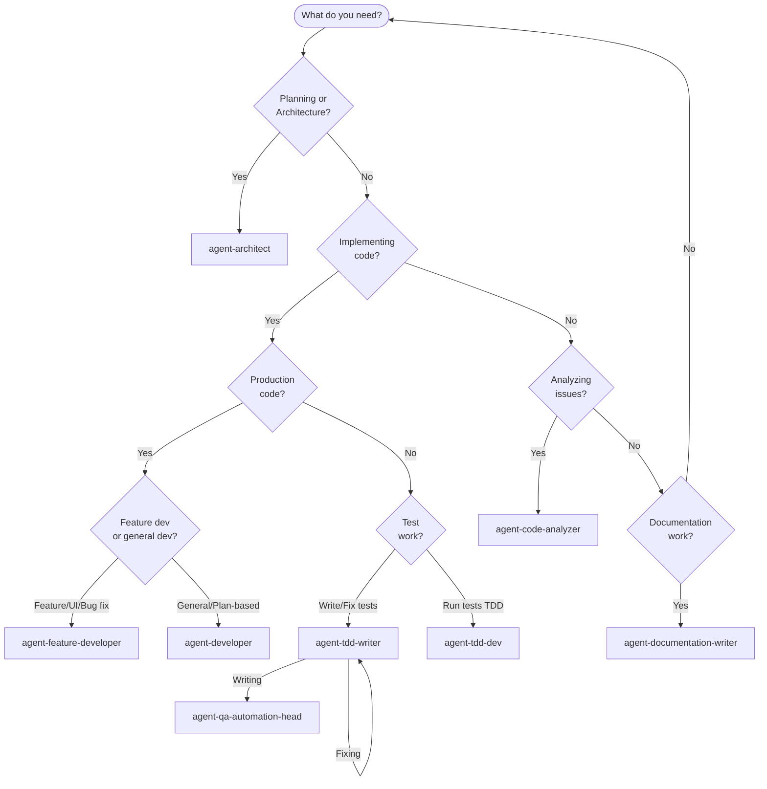

# Agent Selection Guide

> **Quick Reference**: Use this guide to determine which agent to use for your task. Each agent has specific boundaries and expertise.

## Decision Tree

## Agent Comparison Matrix

### Production Code Agents

| Agent | When to Use | Key Differentiator |
|-------|-------------|-------------------|
| **agent-feature-developer** | • Implementing features in production code • Fixing bugs in UI/components • Refactoring production code • API integrations, routing | Focused on feature implementation and UI work |
| **agent-developer** | • Implementing from plans/specs • Analyzing plans before implementing • General code changes • Plan-based development • Executing plans (`/implement-plan-feature`) | Analyzes plans first, asks questions, then implements |

**Decision Rule**: 
- Use `agent-feature-developer` for direct feature/bug work
- Use `agent-developer` when you have a plan/spec to follow

### Test Agents

| Agent | When to Use | Key Differentiator |
|-------|-------------|-------------------|
| **agent-qa-automation-head** | • Writing new tests • Reviewing test quality • Test strategy decisions • Test infrastructure | Comprehensive test writing and quality |
| **agent-tdd-writer** | • Writing tests • Fixing test code • Coverage analysis • Integration tests | Focused on test code only |
| **agent-tdd-dev** | • Running tests • Analyzing test failures • Fixing production code to pass tests • TDD workflow | Runs tests, proposes fixes, implements in production code |

**Decision Rule**:
- Use `agent-qa-automation-head` for comprehensive test writing/review
- Use `agent-tdd-writer` for focused test code work
- Use `agent-tdd-dev` for TDD workflow (run → analyze → fix production code)

### Analysis & Planning Agents

| Agent | When to Use | Key Differentiator |
|-------|-------------|-------------------|
| **agent-architect** | • Planning features • Evaluating approaches • Risk analysis • Reviewing implementations • Creating/revising plans (`/plan-feature`, `/replan-feature`) • Auditing implementations (`/audit-implementation-feature`) | Planning and architectural guidance only |
| **agent-code-analyzer** | • Analyzing bugs/issues • Investigating logs • Root cause analysis • Providing recommendations | Read-only analysis, no implementation |
| **reviewer** (Cursor subagent) | • Reviewing plans (`/review-plan-feature`) • Identifying issues, risks, gaps • **DO NOT** provide recommendations or solutions | Review-only role, no recommendations, no terminal commands |

**Decision Rule**:
- Use `agent-architect` for planning, design, and implementation audits
- Use `agent-code-analyzer` for debugging and investigation
- Use `reviewer` subagent for plan review (via `/review-plan-feature` command)

### Documentation Agents

| Agent | When to Use | Key Differentiator |
|-------|-------------|-------------------|
| **agent-documentation-writer** | • Documenting codebase changes (PR descriptions, changelogs) • Creating project documentation (API docs, guides) • Writing code documentation (docstrings, comments) • Creating technical documentation | Focused on project documentation, not workflow docs |

**Decision Rule**:
- Use `agent-documentation-writer` for project documentation and codebase change docs
- Do NOT use for workflow documents (tasks, proposals, decisions)

## Escalation Paths

### When to Escalate Between Agents

**From agent-developer → agent-architect:**
- Proposed solution requires >3 new abstractions
- Multiple approaches viable, need systematic evaluation
- Architectural risk identified (deadlock, race condition, circular dependency)
- Breaking changes to public APIs required

**From agent-developer → agent-code-analyzer:**
- Issue reproduced but root cause unclear after investigation
- Logs show unexpected behavior requiring forensic analysis
- Regression without obvious cause in recent changes

**From agent-feature-developer → agent-developer:**
- Task requires plan analysis before implementation
- Need to evaluate multiple approaches systematically

**From any agent → agent-qa-automation-head:**
- Need comprehensive test strategy
- Test quality review required
- Test infrastructure changes needed

**From any agent → agent-tdd-writer:**
- Need to write/fix specific test code
- Test coverage gaps identified

**From any agent → agent-tdd-dev:**
- Need to run TDD workflow (run tests → fix production code)

**From any agent → agent-code-analyzer:**
- Bug/issue needs investigation
- Root cause unclear
- Logs need analysis

**From any agent → agent-documentation-writer:**
- Need to document code changes (PR descriptions, changelogs)
- Need to create project documentation (API docs, guides)
- Need code documentation (docstrings, comments)
- Need to understand code for documentation → escalate to code agents first

## Example Scenarios

### Scenario 1: New Feature Implementation
**Task**: "Add user authentication with JWT tokens"

**Recommended Flow**:
1. Start with `agent-architect` or `/plan-feature` → Plan authentication approach, evaluate options
2. Use `reviewer` subagent or `/review-plan-feature` → Review plan for issues, risks, gaps
3. If needed: Use `agent-architect` or `/replan-feature` → Revise plan based on review
4. Move to `agent-developer` or `/implement-plan-feature` → Analyze plan, ask questions, implement
5. Use `agent-architect` or `/audit-implementation-feature` → Audit implementation against plan
6. Use `agent-qa-automation-head` → Write comprehensive tests
7. Use `agent-tdd-dev` → Run tests, fix any production code issues

### Scenario 2: Bug Fix
**Task**: "Video player crashes when pausing during buffering"

**Recommended Flow**:
1. Start with `agent-code-analyzer` → Investigate crash logs, identify root cause
2. Move to `agent-feature-developer` → Fix bug in production code
3. Use `agent-tdd-writer` → Add test to prevent regression

### Scenario 3: Test-Driven Development
**Task**: "Implement chunk buffer with TDD"

**Recommended Flow**:
1. Use `agent-tdd-dev` → Run tests, analyze failures, propose fixes, implement
2. If tests need writing → `agent-tdd-writer` → Write test code
3. If production code needs changes → `agent-tdd-dev` → Fix production code

### Scenario 4: Refactoring
**Task**: "Refactor Redux slice - it's too complex"

**Recommended Flow**:
1. Start with `agent-architect` → Plan refactoring approach, identify risks
2. Move to `agent-feature-developer` → Implement refactoring incrementally
3. Use `agent-qa-automation-head` → Review test coverage, ensure tests still pass

### Scenario 5: Test Coverage Review
**Task**: "Review test coverage for audio processing module"

**Recommended Flow**:
1. Use `agent-tdd-writer` → Analyze coverage gaps
2. Use `agent-qa-automation-head` → Review test quality and strategy
3. Use `agent-tdd-writer` → Write missing tests

### Scenario 6: Documentation
**Task**: "Document the new authentication API endpoints"

**Recommended Flow**:
1. Use `agent-developer` or `agent-feature-developer` → Understand code implementation (if needed)
2. Use `agent-documentation-writer` → Create API documentation following @doc-writing.md guidelines
3. If architectural context needed → `agent-architect` → Get architectural context first

## Quick Reference Card

| Need | Agent / Command |
|------|----------------|
| Plan a feature | `agent-architect` or `/plan-feature` |
| Review a plan | `reviewer` subagent or `/review-plan-feature` |
| Revise a plan | `agent-architect` or `/replan-feature` |
| Implement feature | `agent-feature-developer` or `agent-developer` |
| Implement from plan | `agent-developer` or `/implement-plan-feature` |
| Audit implementation | `agent-architect` or `/audit-implementation-feature` |
| Fix bug | `agent-feature-developer` |
| Analyze bug | `agent-code-analyzer` |
| Write tests | `agent-qa-automation-head` or `agent-tdd-writer` |
| Run TDD workflow | `agent-tdd-dev` |
| Review implementation | `agent-architect` |
| Investigate logs | `agent-code-analyzer` |
| Document code changes | `agent-documentation-writer` |
| Create project docs | `agent-documentation-writer` |

## Agent Boundaries Summary

**Production Code**:
- ✅ `agent-feature-developer`: Features, bugs, UI, refactoring
- ✅ `agent-developer`: Plan-based implementation, analysis-first approach

**Tests**:
- ✅ `agent-qa-automation-head`: Comprehensive test writing, strategy
- ✅ `agent-tdd-writer`: Test code writing/fixing
- ✅ `agent-tdd-dev`: Run tests, fix production code (TDD workflow)

**Analysis**:
- ✅ `agent-architect`: Planning, evaluation, risk analysis, implementation audits
- ✅ `agent-code-analyzer`: Bug investigation, log analysis
- ✅ `reviewer` subagent: Plan review (identify issues, risks, gaps — no recommendations)

**Documentation**:
- ✅ `agent-documentation-writer`: Project documentation, codebase change docs, code docs

**Never Overlap**:
- ❌ Test agents don't modify production code
- ❌ Analysis agents don't implement solutions
- ❌ Production agents don't write test code (except `agent-tdd-dev` in TDD workflow)
- ❌ Documentation agent doesn't modify source code or workflow documents
- ❌ Reviewer subagent doesn't provide recommendations or run terminal commands

