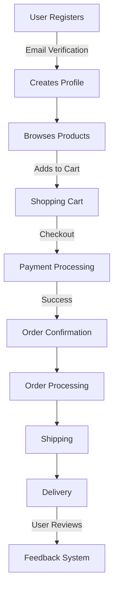

# Command: Analyze Project

> **IMPORTANT**: This command provides a structured approach to analyzing and documenting a software project in its entirety. It covers technical architecture, functionality, business logic, workflows, and operational aspects. This comprehensive analysis is designed to be executed by an LLM in collaboration with a human reviewer.

## Purpose

This command guides the process of analyzing a software project to create clear, accurate, and useful documentation of all its aspects. It helps identify key components, functionality, workflows, patterns, technologies, data flows, design decisions, and operational practices. The resulting analysis serves as a reference for new developers, stakeholders, and team members, facilitating onboarding, knowledge transfer, and project planning.

## Prerequisites

Before analyzing a project, ensure you have:

1. [ ] Access to the project's codebase (ideally with read permissions to all files)
2. [ ] Understanding of the project's technology stack and domain
3. [ ] Project documentation (if any exists)
4. [ ] Project configuration files
5. [ ] Basic understanding of the system's purpose and requirements
6. [ ] Development environment set up (to validate assumptions if needed)
7. [ ] Access to running instances (when possible)
8. [ ] Knowledge of business domain and stakeholders
9. [ ] Information about user types and their needs

## Workspace Usage

This command can be used in any project workspace:

```bash
# Reference the command
@analyze-project.md

# Execute with project context
Execute this command for my project at [project-path]

# Example usage
@analyze-project.md
Context: My React TypeScript application needs comprehensive analysis
Focus: Architecture, performance, and scalability
Requirements: Document current state and identify improvement opportunities
```

## Command Checklist

- [ ] Gather general project information and context
- [ ] Document business purpose and functional requirements
- [ ] Examine project structure and organization
- [ ] Identify key user workflows and business processes
- [ ] Analyze technical architecture and components
- [ ] Document technology stack and dependencies
- [ ] Map data structure and flows
- [ ] Identify integration points with external systems
- [ ] Analyze development, deployment, and operations practices
- [ ] Document non-functional aspects (scalability, security, etc.)
- [ ] Outline team structure and roles
- [ ] Analyze project management and planning approach
- [ ] Create structured documentation with findings
- [ ] Visualize key aspects with diagrams
- [ ] Validate findings through code inspection and stakeholder interviews
- [ ] Provide recommendations for improvements

## Quick Reference

### Key Analysis Areas

- **Project Overview**: Name, purpose, history, team composition
- **Business Context**: Goals, users, core functionality, domain concepts
- **Technical Architecture**: Components, patterns, technologies, data flows
- **Development Practices**: Build, test, deploy, operational processes
- **Integration Points**: External systems, APIs, dependencies
- **Non-Functional Requirements**: Performance, security, scalability

### Common Analysis Commands

```bash
# Project metadata
cat package.json Gemfile pom.xml build.gradle requirements.txt composer.json go.mod

# Documentation search
find . -name "*.md" | grep -i "documentation\|guide\|overview\|readme"

# Version control
git log --oneline -n 10
git shortlog -sn --no-merges

# File type analysis
find . -type f -name "*.js" | wc -l
find . -type f -name "*.py" | wc -l
find . -type f -name "*.rb" | wc -l
```

### Analysis Output Structure

1. **Executive Summary** - High-level project overview
2. **Business Context** - Goals, users, functionality
3. **Technical Architecture** - Components, patterns, technologies
4. **Development Practices** - Build, test, deploy processes
5. **Integration Analysis** - External systems and dependencies
6. **Recommendations** - Improvement opportunities

## Step 1: Gather General Project Information and Context

Begin by collecting high-level information about the project:

```bash
# Examine project metadata
cat package.json # For Node.js projects
cat Gemfile # For Ruby projects
cat pom.xml # For Java/Maven projects
cat build.gradle # For Java/Gradle projects
cat requirements.txt # For Python projects
cat composer.json # For PHP projects
cat go.mod # For Go projects

# Look for README and documentation
cat README.md
find . -name "*.md" | grep -i "documentation\|guide\|overview\|readme"

# Check for version control information
git log --oneline -n 10
git shortlog -sn --no-merges
git branch -a

# Check Memory Bank for historical analysis context (if available)
if [ -d ".memory-bank" ]; then
    echo "Loading historical analysis context from Memory Bank..."

    # Load previous analysis insights
    find .memory-bank/insights -name "*.md" -exec basename {} \; 2>/dev/null || echo "No previous insights found"

    # Check for applicable patterns
    find .memory-bank/patterns -name "*.md" -exec grep -l "analysis\|architecture" {} \; 2>/dev/null || echo "No analysis patterns found"

    # Review relevant decisions
    find .memory-bank/decisions -name "*.md" -exec grep -l "architectural\|technical" {} \; 2>/dev/null || echo "No architectural decisions found"
fi
```

Document your findings on:

- Project name and purpose
- Project history and background
- Team size and composition
- Development timeline
- Current project status
- Key stakeholders
- Main programming languages
- Core frameworks and libraries
- Build tools and processes
- Development environment requirements

## Step 2: Document Business Purpose and Functional Requirements

Understand the business context and functional requirements of the project:

```bash
# Look for requirement documents
find . -name "*.md" -o -name "*.txt" | grep -i "requirements\|specs\|user stories\|features"

# Check for issue tracking or project management references
grep -r "jira\|trello\|asana\|github issue" --include="*.md" --include="*.txt" .

# Look for API documentation that describes functionality
find . -name "swagger*" -o -name "openapi*" -o -name "api*doc*"

# Search for documentation about domain models
grep -r "domain model\|business rules\|entity" --include="*.md" .
```

Document:

- Business goals and objectives
- Target users/customers
- Core functionality and features
- Use cases and user stories
- Domain terminology and concepts
- Business rules and constraints
- Regulatory requirements (if any)
- Success metrics and KPIs

## Step 3: Examine Project Structure and Organization

Analyze how the codebase is organized:

```bash
# List directories at the root level
ls -la

# Count files by type to understand language distribution
find . -type f -name "*.js" | wc -l
find . -type f -name "*.py" | wc -l
find . -type f -name "*.rb" | wc -l
find . -type f -name "*.java" | wc -l
find . -type f -name "*.go" | wc -l
find . -type f -name "*.php" | wc -l

# Look at main entry points
cat main.* app.* index.*

# Check for build configurations
find . -name "webpack*" -o -name "gulp*" -o -name "build.gradle" -o -name "pom.xml" -o -name "Makefile"

# Look for database migration files
find . -name "migrate*" -o -name "*migration*" -o -path "*/migrations/*"
```

Identify and document:

- Main directories and their purposes
- Code organization principles (by feature, layer, etc.)
- Entry points to the application
- Test organization and coverage
- Resource organization
- Database schema organization
- Modularization approach
- Project file naming conventions

## Step 4: Identify Key User Workflows and Business Processes

Understand how users interact with the system and the business processes it supports:

```bash
# Look for UI components and views
find . -path "*/templates/*" -o -path "*/views/*" -o -path "*/components/*" -o -path "*/pages/*"

# Check for route definitions
find . -name "route*" -o -name "url*" -o -name "*routes*"
grep -r "@RequestMapping\|@GetMapping\|router.get\|app.get" --include="*.java" --include="*.js" --include="*.rb" --include="*.py" .

# Look for form handling
grep -r "form\|submit\|input\|validation" --include="*.js" --include="*.jsx" --include="*.vue" --include="*.html" .

# Find workflow-related files
grep -r "workflow\|process\|step\|wizard" --include="*.js" --include="*.java" --include="*.py" --include="*.rb" .
```

Document:

- Main user interfaces and interaction points
- Key user workflows step-by-step
- Business processes the system facilitates
- User roles and permissions
- Form validation and processing
- Notifications and feedback mechanisms
- Error handling from a user perspective
- User authentication and authorization flows

## Step 5: Analyze Technical Architecture and Components

Determine the main architectural approach and building blocks of the system:

```bash
# Look for key components in directory names
find . -type d -not -path "*/node_modules/*" -not -path "*/\.*" | sort

# Search for architectural patterns in code
grep -r "Controller\|Service\|Repository\|Model\|View" --include="*.java" --include="*.js" --include="*.py" --include="*.rb" .

# Identify domain models
find . -name "*Model.js" -o -name "*Entity.java" -o -name "*.rb" | grep -v "test\|spec"

# Look for common design patterns
grep -r "Factory\|Builder\|Singleton\|Adapter\|Observer\|Strategy" --include="*.java" --include="*.js" --include="*.py" --include="*.rb" .

# Identify architectural styles
grep -r "REST\|GraphQL\|MVC\|CQRS\|Event" --include="*.java" --include="*.js" --include="*.py" --include="*.rb" .
```

Document findings on:

- Overall architectural style (Monolithic, Microservices, etc.)
- Application architecture (MVC, MVVM, Clean Architecture, etc.)
- Core components (services, controllers, repositories, etc.)
- Domain models and data structures
- UI components (if applicable)
- Background processing components
- Infrastructure components
- Design patterns in use
- Implementation paradigms (OOP, Functional, Reactive, etc.)
- Domain-specific patterns

## Step 6: Document Technology Stack and Dependencies

Create a comprehensive map of technologies used:

```bash
# Analyze dependencies
npm list --depth=0 # For Node.js
pip freeze # For Python
bundle list # For Ruby
mvn dependency:tree # For Java/Maven
gradle dependencies # For Java/Gradle
composer show # For PHP
go list -m all # For Go

# Check database configuration
grep -r "database\|connection\|datasource" --include="*.config.*" --include="*.yml" --include="*.properties" .

# Identify external integrations
grep -r "api\|http\|client\|fetch\|request" --include="*.js" --include="*.py" --include="*.java" --include="*.rb" .

# Check for container/deployment configurations
find . -name "Dockerfile*" -o -name "docker-compose*" -o -name "*kubernetes*" -o -name "*.tf" -o -name "*.yml"
```

Document your findings on:

- Front-end technologies and frameworks
- Back-end technologies and frameworks
- Database technologies and ORM
- Caching mechanisms
- Message brokers and event systems
- External APIs and integrations
- DevOps and infrastructure tools
- Testing frameworks
- Monitoring and observability tools
- Performance optimization technologies
- Security technologies

## Step 7: Map Data Structure and Flows

Analyze data models and how data moves through the system:

```bash
# Look for schema definitions and migrations
find . -name "schema*" -o -name "*migration*"

# Look for database queries and operations
grep -r "SELECT\|INSERT\|UPDATE\|DELETE" --include="*.java" --include="*.js" --include="*.py" --include="*.rb" .
grep -r "find\|save\|update\|delete\|create" --include="*Repository*" --include="*Dao*" .

# Identify API endpoints
grep -r "router\|route\|endpoint\|@RequestMapping\|@GetMapping" --include="*.java" --include="*.js" --include="*.rb" --include="*.py" .

# Find message processing code
grep -r "consume\|produce\|subscribe\|publish\|listen" --include="*.java" --include="*.js" --include="*.py" --include="*.rb" .

# Look for data validation
grep -r "validate\|validation\|validator" --include="*.java" --include="*.js" --include="*.py" --include="*.rb" .
```

Document:

- Data models and entity relationships
- Database schema design
- Data validation rules
- Data transformation processes
- Data storage approaches
- Key data entities and their lifecycle
- API structure and data formats
- Internal component data flow
- Event flows and message passing
- Database interactions
- Data import/export processes
- Reporting and analytics data flows

## Step 8: Identify Integration Points with External Systems

Determine where the system connects with external components:

```bash
# Look for API clients
grep -r "fetch\|axios\|http\|client\|request" --include="*.js" --include="*.py" --include="*.java" --include="*.rb" .

# Find authentication mechanisms for external systems
grep -r "apiKey\|token\|credentials\|clientId" --include="*.js" --include="*.py" --include="*.java" --include="*.rb" --include="*.config.*" .

# Identify file system interactions
grep -r "readFile\|writeFile\|createFile\|fs\.\|File\." --include="*.js" --include="*.py" --include="*.java" --include="*.rb" .

# Look for payment processing
grep -r "payment\|stripe\|paypal\|checkout" --include="*.js" --include="*.py" --include="*.java" --include="*.rb" .

# Find email or notification services
grep -r "email\|sms\|notification\|sendgrid\|twilio" --include="*.js" --include="*.py" --include="*.java" --include="*.rb" .
```

Document:

- External API usage and dependencies
- Third-party service integrations
- Payment gateways and processors
- Email and notification services
- Authentication services
- File storage services
- Analytics and tracking integrations
- Social media integrations
- CRM and marketing tool integrations
- Compliance and regulatory integrations

## Step 9: Analyze Development, Deployment, and Operations Practices

Examine how the project is developed, deployed, and operated:

```bash
# Check for CI/CD configuration
find . -name "*.yml" -o -name "*.yaml" | grep -i "github\|gitlab\|jenkins\|circle\|travis\|azure"

# Look for deployment scripts
find . -name "deploy*" -o -name "*deployment*"

# Check for infrastructure as code
find . -name "*.tf" -o -name "cloudformation*" -o -name "*.cdk.*"

# Identify environment configurations
find . -name ".env*" -o -name "*config.*"

# Look for testing setups
find . -path "*/test/*" -o -path "*/spec/*"
```

Document:

- Development workflow
- Code review process
- Testing strategies and practices
- CI/CD pipeline structure
- Deployment strategies
- Environment management
- Infrastructure provisioning
- Monitoring and alerting setup
- Backup and recovery processes
- Logging practices
- Security practices
- Performance testing approaches

## Step 10: Document Non-Functional Aspects

Evaluate how the system addresses important non-functional requirements:

```bash
# Look for caching mechanisms
grep -r "cache\|memoize\|Cache" --include="*.js" --include="*.py" --include="*.java" --include="*.rb" .

# Find concurrency handling
grep -r "async\|await\|Promise\|Thread\|concurrent\|parallel" --include="*.js" --include="*.py" --include="*.java" --include="*.rb" .

# Identify security measures
grep -r "encrypt\|hash\|password\|security\|sanitize\|escape" --include="*.js" --include="*.py" --include="*.java" --include="*.rb" .

# Check for error handling patterns
grep -r "try\|catch\|except\|error\|throw\|rescue" --include="*.js" --include="*.py" --include="*.java" --include="*.rb" .

# Look for performance optimizations
grep -r "optimize\|performance\|lazy\|throttle\|debounce" --include="*.js" --include="*.py" --include="*.java" --include="*.rb" .

# Find accessibility considerations
grep -r "a11y\|accessibility\|aria" --include="*.js" --include="*.jsx" --include="*.html" --include="*.css" .
```

Document findings on:

- Performance optimization strategies
- Scalability approaches
- Security mechanisms and practices
- Error handling and resilience patterns
- Monitoring and observability
- Compliance features
- Accessibility considerations
- Internationalization and localization
- Browser/device compatibility
- Load balancing and redundancy
- Backup and disaster recovery

## Step 11: Outline Team Structure and Roles

Understand the team organization around the project:

```bash
# Look at contributors
git shortlog -sn --no-merges

# Check for team documentation
find . -name "*.md" | grep -i "team\|contributing\|onboarding"

# Look for code owners
cat .github/CODEOWNERS 2>/dev/null || echo "No CODEOWNERS file found"

# Find documentation about roles
grep -r "role\|responsibility\|team\|squad" --include="*.md" .
```

Document:

- Team structure and organization
- Roles and responsibilities
- Code ownership and areas of expertise
- Communication channels
- Decision-making processes
- Onboarding practices
- Knowledge sharing mechanisms
- Cross-team dependencies

## Step 12: Analyze Project Management and Planning Approach

Identify how the project is managed and planned:

```bash
# Look for project management references
grep -r "sprint\|milestone\|backlog\|roadmap" --include="*.md" .

# Check for issue templates
find .github/ -name "ISSUE_TEMPLATE*" 2>/dev/null

# Look for release planning
find . -name "CHANGELOG*" -o -name "RELEASE*"
```

Document:

- Project management methodology (Agile, Kanban, etc.)
- Sprint/iteration length
- Planning processes
- Backlog management
- Release planning and versioning
- Issue tracking and management
- Feature prioritization approach
- Timeboxing and estimation practices

## Step 13: Create Structured Documentation with Findings

Organize your findings into a comprehensive project documentation:

### Project Documentation Template

```markdown
# Project Name Documentation

## 1. Project Overview

- Project purpose and goals
- Business context and value
- History and current status
- Key stakeholders

## 2. Business Functionality

- Core features and capabilities
- User types and personas
- Key workflows and business processes
- Business rules and constraints

## 3. Technical Architecture

- Overall architectural approach
- Component structure and responsibilities
- Design patterns and principles
- Data architecture

## 4. Technology Stack

- Frontend technologies
- Backend technologies
- Databases and storage
- Infrastructure components
- Third-party services and APIs

## 5. Development Practices

- Development workflow
- Testing strategy
- Code organization and standards
- Continuous integration

## 6. Deployment and Operations

- Deployment architecture
- Environment management
- Monitoring and alerting
- Backup and recovery
- Security practices

## 7. Project Management

- Team structure and roles
- Planning and tracking
- Release management
- Communication channels

## 8. Non-Functional Characteristics

- Performance considerations
- Scalability approach
- Security implementation
- Accessibility
- Internationalization

## 9. Future Roadmap

- Planned features and enhancements
- Technical debt and improvements
- Strategic direction

## Appendix

- Glossary of terms
- Reference documentation
- Common troubleshooting
```

## Step 14: Visualize Key Aspects with Diagrams

Create diagrams to illustrate important aspects of the project:

1. **Business Context Diagram**: Shows project in relation to business stakeholders
2. **User Journey Maps**: Visualize key user workflows
3. **System Context Diagram**: Shows the system in relation to external entities
4. **Container Diagram**: Shows high-level technical building blocks
5. **Component Diagram**: Shows main components within containers
6. **Entity Relationship Diagram**: For data models
7. **Deployment Diagram**: Shows runtime environment
8. **Team Topology**: Shows team structure and interactions

Use tools like:

- [C4 Model](https://c4model.com/) for system architecture
- [Mermaid](https://mermaid-js.github.io/mermaid/) for inline documentation diagrams
- [PlantUML](https://plantuml.com/) for UML diagrams
- [draw.io](https://draw.io/) for custom diagrams
- [User journey maps](https://uxpressia.com/) for user workflows

Example Mermaid business process diagram:



## Step 15: Validate Findings through Code Inspection and Stakeholder Interviews

Verify your understanding by examining key code sections and interviewing stakeholders:

```bash
# Examine main configuration
cat *config*.js main.* app.*

# Look at key service implementations
find . -name "*Service*.js" -o -name "*Service*.java" -o -name "*service*.py" -o -name "*service*.rb" | head -n 5

# Check component interconnections
grep -r "import\|require" --include="*.js" --include="*.ts" | grep "Service" | head -n 10

# Run the application in development mode (if possible)
npm run dev # or equivalent for the project
```

Validate with stakeholders:

- Business purpose and value
- Key workflows and processes
- Team structure and roles
- Future roadmap and priorities
- Pain points and challenges
- Success metrics and goals

Validate through code inspection:

- Component responsibilities match your understanding
- Interaction patterns are as documented
- Data flows follow your map
- Architectural patterns are implemented as expected
- Business rules and logic are accurately captured

## Step 16: Provide Recommendations for Improvements

Based on your analysis, identify potential areas for improvement:

1. **Business Value Enhancement**: Opportunities to better serve business needs
2. **User Experience Improvement**: Ways to enhance user workflows
3. **Technical Architecture**: Architectural improvements for better maintainability
4. **Code Quality**: Areas for refactoring and cleanup
5. **Performance Optimization**: Performance bottlenecks and solutions
6. **Security Enhancements**: Security vulnerabilities and mitigations
7. **Process Improvement**: Development and operational process optimizations
8. **Documentation Needs**: Areas requiring better documentation
9. **Testing Coverage**: Gaps in testing and quality assurance
10. **Innovation Opportunities**: New technologies or approaches to consider

Provide actionable recommendations for each area, considering:

- Business impact
- Implementation effort
- Technical risk
- Long-term benefits
- Prioritization guidance

## Examples

### Example 1: Analyzing an E-Commerce Project

```bash
# Checking project type and dependencies
cat package.json
npm list --depth=0

# Examining project structure
find . -type d -not -path "*/node_modules/*" -not -path "*/\.*" -maxdepth 2

# Looking at business logic
find . -name "*Product*" -o -name "*Order*" -o -name "*Cart*" -o -name "*Payment*"

# Checking user workflows
grep -r "checkout\|payment\|shipping\|order" --include="*.js" --include="*.jsx" .

# Examining database schema
cat db/schema.rb # For Rails
cat */models/*.js # For Node.js/Mongoose
```

### Example 2: Analyzing a Financial System

```bash
# Identifying core business entities
find . -name "*Account*" -o -name "*Transaction*" -o -name "*Payment*" -o -name "*Report*"

# Understanding financial calculations
grep -r "calculate\|compute\|formula" --include="*.java" --include="*.js" .

# Checking regulatory compliance
grep -r "compliance\|regulation\|audit" --include="*.java" --include="*.js" --include="*.md" .

# Examining security measures
grep -r "encrypt\|secure\|auth\|permission" --include="*.java" --include="*.js" .

# Looking at integration points
grep -r "bank\|gateway\|api\|external" --include="*.java" --include="*.js" .
```

## Common Issues and Solutions

| Issue                              | Solution                                                        |
| ---------------------------------- | --------------------------------------------------------------- |
| Incomplete documentation           | Focus on code structure and behavior as primary source of truth |
| Complex business domain            | Interview domain experts and create a glossary of terms         |
| Vast codebase                      | Sample representative parts and focus on key workflows          |
| Legacy and modern code mixed       | Document both approaches and note transition strategy           |
| Conflicting architectural patterns | Identify dominant patterns and document evolution               |
| Undocumented integrations          | Look for API keys and external URLs in configuration files      |
| Unclear business purpose           | Interview stakeholders and examine user-facing aspects          |
| Diverse technology stack           | Group technologies by functional area and document interfaces   |

## LLM Reasoning for Project Analysis

When analyzing a project, apply systematic reasoning:

1. **Holistic Understanding**: Consider business, technical and operational aspects together
2. **Multi-level Analysis**: Examine both high-level structure and low-level details
3. **Purpose-driven Exploration**: Keep business goals and user needs in focus
4. **Pattern Recognition**: Identify recurring patterns across both business and technical domains
5. **Assumption Testing**: Validate assumptions through code examination
6. **Contextual Awareness**: Consider project context, constraints, and business domain
7. **Evolution Tracking**: Note how the project has evolved and why changes were made
8. **Empathetic Perspective**: Consider the perspectives of developers, users, and business stakeholders

Document your reasoning process as you analyze, noting observations, inferences, areas of uncertainty, and the connections between business and technical aspects.

## Related Documents

- [Create Documentation Map](mdc:commands/update-documentation-map.md)
- [Create Technical Overview](mdc:templates/technical-overview-template.md)

## Workspace Integration Notes

This command is designed for workspace integration and adapts to your project's structure:

- **Project Analysis**: Works with any project structure and technology stack
- **Documentation Output**: Creates analysis documents in your project's docs structure
- **Cross-References**: Uses `mdc:` links for workspace navigation
- **Command Usage**: Reference with `@analyze-project.md` in your workspace

---

**Last Updated**: 2024-04-13
