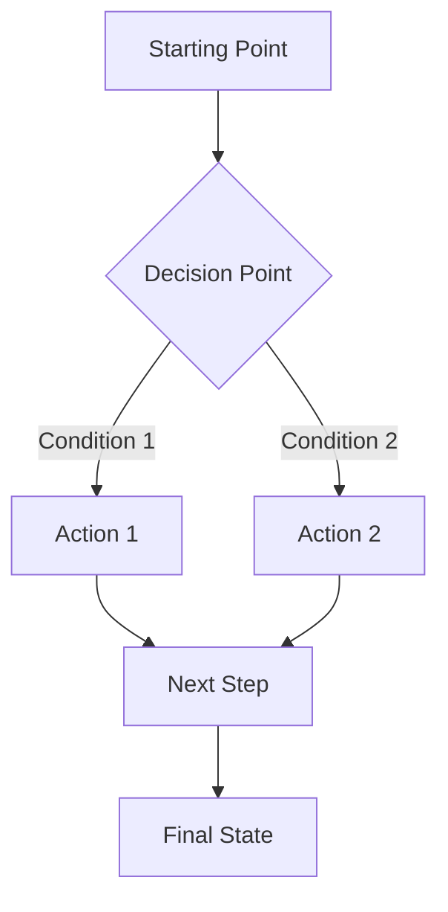

# Command: Create Pitch/TD Document

> **IMPORTANT**: Creates a production-ready pitch or Technical Decision (TD) document for team, guild, or colleagues with proper structure, approval workflows, and cross-references.

## Purpose

Create a new pitch or TD document with the right structure, metadata, naming, and references so teams can effectively communicate proposals, request decisions, and track approvals. Pitch documents are used for:

- **Technical Decisions (TD)**: Infrastructure changes, architecture decisions, system migrations
- **Team Pitches**: Feature proposals, process improvements, resource requests
- **Roadmap Pitches**: Strategic initiatives, quarterly planning, project proposals
- **Guild/Cross-team Requests**: Inter-team collaboration, platform requests, integration proposals

## Workspace Usage

```bash
# Reference the command
@create-pitch.md

# Execute with project context
Execute this command for my project at [project-path]

# Example usage
@create-pitch.md
Type: TD
Topic: S3 Dev Branch Hosting Infrastructure
Audience: Infrastructure Team, Frontend Lead
Purpose: Request infrastructure support for S3-based branch hosting
```

## Command Checklist (Minimal)

- [ ] Determine pitch type (TD/Pitch/Roadmap) and target audience
- [ ] Get current date for document timestamping
- [ ] Analyze existing pitch documents for naming patterns
- [ ] Create file with appropriate naming: `TD-{topic-slug}.md` or `{topic-slug}-pitch.md`
- [ ] Insert required sections based on pitch type (see Templates section)
- [ ] Add approval checklist if TD document
- [ ] Add cross-references to related tasks/proposals/contexts
- [ ] Update Documentation Map
- [ ] Validate links and structure

## Quick Start (Skip to Step 7 if you know what you're doing)

If you need a pitch RIGHT NOW:

1. **Choose type**: TD (Technical Decision) or Pitch (Team/Guild proposal)
2. **Name file**: `TD-{topic-slug}.md` for TD, `{topic-slug}-pitch.md` for Pitch
3. **Copy template** from Step 7 below based on type
4. **Fill approval checklist** if TD document
5. **Add links** in References section

For detailed analysis and project integration, follow Steps 1-6 below.

## Step 1: Analyze Existing Pitch Structure

### 1.1. Map Existing Pitch Documents

```bash
# Find all pitch files
find .pythia/pitch -name "*.md" -type f | head -20

# Extract document types
find .pythia/pitch -name "*.md" -type f | sed 's/.*\///' | sed 's/-.*//' | sort | uniq

# Count by type
find .pythia/pitch -name "TD-*.md" | wc -l  # TD documents
find .pythia/pitch -name "*-pitch.md" | wc -l  # Pitch documents
```

### 1.2. Identify Pitch Patterns

```bash
# Analyze naming patterns
find .pythia/pitch -name "*.md" -type f | xargs -I {} basename {} | sort

# Check for approval checklists (TD documents)
grep -l "Approval Checklist" .pythia/pitch/*.md
```

### 1.3. Understand Audience Types

Based on existing pitches, identify common audiences:

- Infrastructure Team
- Frontend/Backend Teams
- Platform Team
- Executive Team
- Guild/Cross-team
- Technical Team Review

## Step 2: Determine Creation Date

```bash
# Get current date for LLM
CURRENT_DATE=$(date +%Y-%m-%d)
echo "Current date: $CURRENT_DATE"
```

## Step 3: Determine Pitch Type

### 3.1. Analyze Pitch Purpose

- **TD (Technical Decision)**: Infrastructure changes, system migrations, technical architecture decisions
  - Requires approval checklist with roles
  - Includes technical requirements
  - Has implementation plan
  - Decision request section

- **Pitch (Team/Guild)**: Feature proposals, process improvements, resource requests
  - Executive summary
  - Current challenges
  - Proposed solution
  - Expected impact
  - Request for feedback/decision

- **Roadmap Pitch**: Strategic initiatives, quarterly planning
  - Executive summary with business impact
  - Priority projects
  - Implementation strategy
  - Success metrics

### 3.2. Choose Appropriate Type

- **Follow existing patterns** in the project
- **TD for technical decisions** requiring infrastructure/architecture changes
- **Pitch for team/guild proposals** requiring collaboration or resources
- **Roadmap for strategic planning** and quarterly initiatives

## Step 4: Determine Target Audience

### 4.1. Identify Stakeholders

Based on pitch type and content, identify:

- **Decision makers**: CTO, Team Leads, Infrastructure Lead
- **Reviewers**: Technical Team, Platform Team
- **Implementers**: Development teams, Infrastructure team
- **Stakeholders**: Executive Team, Product Team

### 4.2. Create Approval Checklist (for TD documents)

```markdown
## Approval Checklist

| Role                | Name  | Approval Date | Signature |
| ------------------- | ----- | ------------- | --------- |
| CTO                 | @Name |               |           |
| Infrastructure Lead | @Name |               |           |
| Frontend Lead       | @Name |               |           |
```

## Step 5: Create File Name

### 5.1. Apply Naming Pattern

```bash
# Get current date
CURRENT_DATE=$(date +%Y-%m-%d)

# For TD documents
TYPE="TD"
TOPIC="s3-dev-branch-hosting"
FILENAME="${TYPE}-${TOPIC}.md"

# For Pitch documents
TYPE="pitch"
TOPIC="unified-sdk-security"
FILENAME="${TOPIC}-${TYPE}.md"

# For Roadmap documents
TYPE="roadmap"
TOPIC="q3-performance-optimization"
FILENAME="${TYPE}-${TOPIC}-${TYPE}.md"
```

### 5.2. Validate Naming

- Check if similar files exist
- Ensure uniqueness
- Follow project conventions (TD- prefix for Technical Decisions)
- Use kebab-case for topic slugs

## Step 6: Create Pitch File

```bash
# Create file with determined name
PITCH_DIR=".pythia/pitch"
PITCH_FILE="$PITCH_DIR/$FILENAME"
mkdir -p "$PITCH_DIR"
[ -f "$PITCH_FILE" ] || touch "$PITCH_FILE"
echo "Created: $PITCH_FILE"
```

## Step 7: Insert Template Based on Type

### Template 1: TD (Technical Decision) Document

Paste the following TD Template into the new file:

````markdown
# TD: {Title}

**Date**: YYYY-MM-DD  
**Status**: Technical Definition  
**For**: {Target Audience}  
**Author**: {Team/Author Name}  
**Related Epic**: [EPIC-XXX]({link}) - {Epic Name}  
**Related Issues**: [ISSUE-XXX]({link}) ({Description}), [ISSUE-YYY]({link}) ({Description})  
**Depends On**: [Related TD/Pitch](mdc:path/to/related-doc.md)

| Role                | Name  | Approval Date | Signature |
| ------------------- | ----- | ------------- | --------- |
| CTO                 | @Name |               |           |
| Infrastructure Lead | @Name |               |           |
| Frontend Lead       | @Name |               |           |

{Brief description of what this TD defines and why it exists. Explain the scope and key concepts.}

{info}**Dependency:** {If this document depends on other work, explain the dependency here.}{info}

## Core Components

The {system name} consists of **{number} components**:

1. **{Component 1}** - {Brief description}
2. **{Component 2}** - {Brief description}
3. **{Component 3}** - {Brief description}

{info}{Additional context about components if needed}{info}

## Current State

### {Current System Aspect 1}

{Description of current implementation or state}

- [Current characteristic 1]
- [Current characteristic 2]
- [Current limitation or issue]

### {Current System Aspect 2}

{Description of another aspect}

- [Current characteristic 1]
- [Current characteristic 2]

### This System Provides

{What the new system will provide that current system doesn't}

- [Capability 1]
- [Capability 2]
- [Capability 3]

## Problem Context

{info}**Note:** {Important context or clarification about what this document addresses}{info}

### Scenarios We Handle

**1. {Scenario Category 1}**

- [Specific scenario]
- [Specific scenario]
- [Impact or requirement]

**2. {Scenario Category 2}**

- [Specific scenario]
- [Specific scenario]

**3. {Scenario Category 3}**

- [Specific scenario]
- [Specific scenario]

### User Experience Problems

- [Problem 1]
- [Problem 2]
- [Problem 3]

### What We Need

- [Requirement 1]
- [Requirement 2]
- [Requirement 3]

## {Technical States / Data States / System States}

{If applicable, describe the states or modes the system will have}

### {State Category}

1. **`{state-name}`** - {Description}
2. **`{state-name}`** - {Description}
3. **`{state-name}`** - {Description}

### Additional Information

- **`{flag-name}`** - {Description}
- **`{flag-name}`** - {Description}

### {Priority / Classification}

- **Critical:** {Items} ({timeframe})
- **Important:** {Items} ({timeframe})
- **Normal:** {Items} ({timeframe})

## System Flow

{Description of how the system responds to different states or inputs}


````

## {Response Levels / Architecture Levels / UI Response Levels}

### {Level 1} Responses

Used when {condition for this level}.

**When to Use:**

- **{Use case 1}**
- **{Use case 2}**

**{Approach / Implementation}:**

- [Characteristic 1]
- [Characteristic 2]

**Example Scenarios:**

**Scenario 1: {Scenario Name}**

- **State:** {State description}
- **Response:** {Response description}
- **Actions:** {Available actions}
- **Why {level}:** {Justification}

**Scenario 2: {Scenario Name}**

- **State:** {State description}
- **Response:** {Response description}
- **Actions:** {Available actions}

### {Level 2} Responses

{Similar structure for other levels}

## {Use Case Scenarios / Fallback Scenarios}

### Scenario 1: {Scenario Name}

**Situation:** {Context}

**Case A: {Case Name}**

- [Behavior description]
- [UI/System response]
- [User experience]

**Case B: {Case Name}**

- [Behavior description]
- [UI/System response]
- [User experience]

**Case C: {Case Name}**

{info}{Special note if applicable}{info}

### Scenario 2: {Scenario Name}

{Similar structure}

## {Component Specifications / System Components}

### 1. {Component Name}

**Purpose:** {What this component does}

**Functional Requirements:**

- [Requirement 1]
- [Requirement 2]
- [Requirement 3]

**{Visual / Technical} Variants:**

- **{Variant 1}:** {Description}
- **{Variant 2}:** {Description}

**Example {Messages / Configurations}:**

- "{Example 1}"
- "{Example 2}"

### 2. {Component Name}

{Similar structure}

## Decision Matrix

When should the system respond at which level?

### Simple Rules (Priority Order)

1. **{Condition}** → **{Response}**
2. **{Condition}** → **{Response}**
3. **{Condition}** → **{Response}**

### State Combinations

| {State 1} | {State 2} | {State 3} | Response               |
| --------- | --------- | --------- | ---------------------- |
| {value}   | {value}   | {value}   | {Response description} |
| {value}   | {value}   | {value}   | {Response description} |

### {Failure / Edge Case} Handling

**{Case description}:**

- **{Condition}** → **{Response}**
- **{Condition}** → **{Response}**

## Interaction Patterns

### {Pattern Name}

**Automatic (Background):**

- **{Error type}:** {Retry strategy}
- **{Error type}:** {Retry strategy}
- **{Error type}:** {Retry strategy}

**After Max Retries:**

- {Condition} → {Response}
- {Condition} → {Response}

**Manual (User-Triggered):**

- {Description}
- {Behavior}

**Integration with {System}:**

{System} handles {aspect} automatically:

- [Detail 1]
- [Detail 2]

### {Another Pattern}

{Similar structure}

## Best Practices

### 1. {Practice Title}

{Description}

1. **{Option 1}**
2. **{Option 2}**
3. **{Option 3}**

{warning}**Never:** {Anti-pattern to avoid}{warning}

### 2. {Practice Title}

| Bad             | Good             |
| --------------- | ---------------- |
| "{Bad example}" | "{Good example}" |

### 3. {Practice Title}

**{Approach 1}:** {Description}

- "{Example 1}"
- "{Example 2}"

**{Approach 2}:** {Description}

- "{Example 1}"
- "{Example 2}"

## Component Specifications

### 1. {Component Name}

**Props:**

- `{propName}` ({type}) - {Description}
- `{propName}` ({type}) - {Description}

**Functional Requirements:**

- [Requirement 1]
- [Requirement 2]

**Integration Pattern:**

{How this component integrates with the system}

### 2. {Component Name}

{Similar structure}

## Testing Scenarios

### Test Each {Aspect}

1. **{Test case 1}**
2. **{Test case 2}**
3. **{Test case 3}**

### Test Transitions

1. **{State 1} → {State 2}** ({Description})
2. **{State 1} → {State 2}** ({Description})

### Test Mixed States

1. {Scenario description}
2. {Scenario description}

### Test Edge Cases

1. {Edge case 1}
2. {Edge case 2}

## {Error Tracking & Analytics / Monitoring & Observability}

### Current Implementation

**{Tool/System} ({Purpose}):**

- [Current behavior]
- [Current limitations]

**{Another Tool} ({Purpose}):**

- [Current behavior]
- [Current limitations]

### Considerations for {New System}

**{Tool/System} ({Status}):**

{tip}{Note about current state}{tip}

**{Another Tool} ({Needs Improvement}):**

**Option 1: {Approach} (Recommended)**

- [Detail 1]
- [Detail 2]

**Option 2: {Alternative Approach}**

- [Detail 1]
- [Detail 2]

**Recommended Approach:**

{Description}

## {Integration Considerations / TTS Integration / Accessibility}

{If applicable, describe integration with other systems}

**{System Name}:**

- [Integration point 1]
- [Integration point 2]

**{Component Name}:**

- [Integration detail 1]
- [Integration detail 2]

{info}{System} automatically {behavior}{info}

## Design Deliverables Needed

### Design Deliverables (Priority 1)

- **{Component} designs** ({number} variants: {variants})
- **{Component} designs** ({number} variants: {variants})
- **{Element} designs** ({description})

### Additional Design Elements

- {Element 1}
- {Element 2}
- {Element 3}

## Migration Strategy

### Current State Analysis

**1. Audit existing {aspect}:**

- [Task 1]
- [Task 2]

**2. Identify existing patterns:**

- {Pattern 1} → Migrate to **{New Component}**
- {Pattern 2} → Migrate to **{New Component}**

**3. Plan breaking changes:**

- [Change 1]
- [Change 2]

### Migration Path

**1. Introduce new {components}** (without removing old code)

- Deploy **{Component 1}**, **{Component 2}**
- Feature flag: `{FLAG_NAME}` (default: false)
- Test in dev/QA environments

**2. Gradual {migration type}**

- Migrate {items} one at a time
- A/B test: Compare {metrics}

**3. Remove legacy code**

- After all {items} migrated, remove old {code}
- Clean up unused {components}
- Update documentation

**4. Enable by default**

- Remove feature flag
- Monitor metrics for {duration}
- Fix any remaining issues

### Compatibility Layer

{If needed, describe adapter pattern for gradual migration}

## Implementation Checklist

### Phase 1: Core Components

- [ ] Create **{Component 1}** with {requirements}
- [ ] Create **{Component 2}** with {requirements}
- [ ] Add TypeScript interfaces for all props
- [ ] Write unit tests for each component
- [ ] Create Storybook stories for visual testing

### Phase 2: Integration

- [ ] Integrate **{Component 1}** with {system}
- [ ] Add **{Component 2}** to {system}
- [ ] Connect **{Component 3}** to {system}
- [ ] Implement {logic/pattern}
- [ ] Add telemetry events

### Phase 3: Migration

- [ ] Audit existing {patterns}
- [ ] Migrate {Area 1} to new components
- [ ] Migrate {Area 2} to new components
- [ ] Remove legacy {code}
- [ ] Update documentation

### Phase 4: Testing & Launch

- [ ] Test with {real conditions}
- [ ] Test with {accessibility tools}
- [ ] Test with {TV-specific requirements}
- [ ] Monitor metrics for {duration}
- [ ] Fix issues, iterate on feedback

## Related Documentation

### Technical Definitions

- [{Related TD Name}](mdc:path/to/doc.md) - {Description}

### Jira Epics & Issues

- [{EPIC-XXX}]({link}) - {Epic Name}
- [{ISSUE-XXX}]({link}) - {Issue Description}

---

**Last Updated**: YYYY-MM-DD  
**Status**: Technical Definition for {Review Type}

`````

### Template 2: Team/Guild Pitch Document

Paste the following Pitch Template into the new file:

````markdown
# {Title} Pitch

**Date**: YYYY-MM-DD
**Status**: Draft
**For**: {Target Audience}
**Author**: {Team/Author Name}
**Deadline**: {If applicable}

## Executive Summary

[Brief overview of the proposal, current state, target state, and business impact]

| Current State       | Target State      | Business Impact      |
| ------------------- | ----------------- | -------------------- |
| [Current situation] | [Desired outcome] | [Impact description] |

## 1. Goals and Objectives

### 1.1 {Goal Title}

- [Objective 1]
- [Objective 2]

### 1.2 {Goal Title}

- [Objective 1]
- [Objective 2]

## 2. Solution Request

**By {deadline}**, we request:

1. [Request item 1]
2. [Request item 2]
3. [Request item 3]

**Important**: [Any critical notes about the request]

## 3. {Solution Component Title}

### 3.1 {Sub-component}

- [Requirement/Description 1]
- [Requirement/Description 2]

**Example:**

```{language}
{code example}
`````

```

### 3.2 {Sub-component}

- [Requirement/Description 1]
- [Requirement/Description 2]

## 4. Planned Work Based on {Solution}

### Direction 1: {Work Area}

- [Planned activity 1]
- [Planned activity 2]
- **Goal**: [Expected outcome]

### Direction 2: {Work Area}

- [Planned activity 1]
- [Planned activity 2]

## 5. Timeline ({Duration} Period)

| Period                    | Activities             |
| ------------------------- | ---------------------- |
| **YYYY-MM-DD–YYYY-MM-DD** | [Activity description] |
| **YYYY-MM-DD–YYYY-MM-DD** | [Activity description] |

## 6. Success Metrics

| Metric        | Current State   | Target State   |
| ------------- | --------------- | -------------- |
| [Metric name] | [Current value] | [Target value] |

## 7. Interaction Processes During Implementation

### Incidents

- **Critical level**: [Response time], [Resolution time]
- **High level**: [Response time], [Resolution time]

### Interface Changes

- [Process description]

## 8. Escalations and Consequences of Rejection

### Escalation

[Escalation process description]

### Consequences of Rejection

- [Consequence 1]
- [Consequence 2]

## 9. Response Format

We request one of three responses for each request item:

1. **"Accept with delivery date"**
2. **"Reject with justification"**
3. **"Propose alternative with date"**

**Response must be sent as a single message or document by the specified deadline.**

---

## Appendices

### A. {Appendix Title}

- [Detail 1]
- [Detail 2]

---

**Document prepared by {Team} for {Purpose}.**

```

### Template 3: Roadmap Pitch Document

Paste the following Roadmap Template into the new file:

```markdown
# {Title}: {Subtitle} Pitch

**Date**: YYYY-MM-DD
**Status**: Draft
**For**: {Target Audience}
**Author**: {Team/Author Name}

## Executive Summary

[Overview of the roadmap, current challenges, and strategic goals]

| Current State       | Target State      | Business Impact      |
| ------------------- | ----------------- | -------------------- |
| [Current situation] | [Desired outcome] | [Impact description] |

## Critical {Area} Issues

1. **{Issue Category 1}**:
   - [Issue description]
   - [Impact]

2. **{Issue Category 2}**:
   - [Issue description]
   - [Impact]

## Priority Projects

### 1. {Project Name} ({Priority Level})

**Business Value**: [Value proposition]

**Implementation Highlights**:

- [Highlight 1]
- [Highlight 2]

**Expected Impact**:

- [Impact metric 1]
- [Impact metric 2]

### 2. {Project Name} ({Priority Level})

**Business Value**: [Value proposition]

**Implementation Highlights**:

- [Highlight 1]
- [Highlight 2]

**Expected Impact**:

- [Impact metric 1]
- [Impact metric 2]

## Additional Improvement Opportunities

Beyond priority projects, we've identified several supplementary improvements:

- **{Opportunity 1}**: [Description]
- **{Opportunity 2}**: [Description]

## Business Impact Analysis

### {Impact Category} Improvements

- [Improvement 1]
- [Improvement 2]

### Development Efficiency Gains

- [Gain 1]
- [Gain 2]

## Implementation Strategy

### Phased Approach

1. **Immediate ({Timeframe})**:
   - [Action 1]
   - [Action 2]

2. **Progressive Rollout**:
   - [Action 1]
   - [Action 2]

### Team Structure

- [Role 1]
- [Role 2]

## Decision Request

We request {audience} approval to:

1. [Request 1]
2. [Request 2]
3. [Request 3]

[Summary of strategic value]

---

## Related Documents

- [Related document 1]
- [Related document 2]
```

## Step 8: Add Cross-References

### 8.1. Add References Section

Add links to related documents:

```markdown
## References

- [Related Context](mdc:.pythia/contexts/...)
- [Related Task](mdc:.pythia/workflows/tasks/task-YYYY-MM-topic.md)
- [Related Proposal](mdc:.pythia/workflows/proposals/...)
- [Related Decision](mdc:.pythia/workflows/decisions/...)
```

### 8.2. Bidirectional Links

- From the pitch: link to related tasks/proposals/contexts
- From related tasks/proposals: add a link back to this pitch in their References section
- Update related documents if they exist

## Step 9: Update Documentation Map

Add the new pitch to the Documentation Map:

```bash
@update-documentation-map.md
```

## Step 10: Validation

Validate links and structure:

```bash
@validate-documentation.md
```

If broken links are reported, fix paths and re-run.

## Step 11: Final Check

- [ ] All required sections are present
- [ ] Approval checklist filled (for TD documents)
- [ ] All links work
- [ ] Document follows project conventions
- [ ] Metadata is complete (Date, Status, Author, For)
- [ ] Decision request is clear
- [ ] Documentation Map updated

## Acceptance Criteria

- Pitch file exists with appropriate naming (`TD-{topic}.md` or `{topic}-pitch.md`)
- All required sections filled based on pitch type
- Approval checklist present (for TD documents)
- Metadata block complete (Date, Status, Author, For, Deadline if applicable)
- Cross-references to at least one related document (task/proposal/context)
- Documentation Map updated
- Link validation passes

## Common Pitch Types and When to Use Them

### TD (Technical Decision)

**Use when:**

- Requesting infrastructure changes
- Proposing system migrations
- Need technical architecture decisions
- Require formal approval from multiple stakeholders
- Defining UI/UX patterns and component specifications
- Creating technical definitions for design teams
- Documenting system behavior and interaction patterns

**Key sections (Required):**

- Metadata (Date, Status, For, Author, Related Epic/Issues, Depends On)
- Overview with dependency notes
- Core Components
- Current State (with sub-sections)
- Problem Context (with scenarios)
- System Flow (with Mermaid diagram)
- Component Specifications
- Implementation Checklist

**Optional sections (add as needed):**

- Data/Technical States
- Response Levels / Architecture Levels
- Use Case Scenarios / Fallback Scenarios
- Decision Matrix
- Interaction Patterns
- Best Practices
- Testing Scenarios
- Error Tracking & Analytics
- Integration Considerations (TTS, Accessibility, etc.)
- Design Deliverables Needed
- Migration Strategy

**Structure notes:**

- Use `{info}`, `{warning}`, `{tip}`, `{note}` callouts for important context
- Include Mermaid diagrams for system flows
- Provide detailed example scenarios
- Add decision matrices for complex logic
- Include comprehensive testing scenarios

### Team/Guild Pitch

**Use when:**

- Requesting resources from another team
- Proposing cross-team collaboration
- Need platform/infrastructure support
- Requesting process changes

**Key sections:**

- Executive Summary with comparison table
- Solution Request with deadline
- Detailed component requirements
- Planned work
- Timeline
- Success metrics
- Escalation process

### Roadmap Pitch

**Use when:**

- Strategic planning initiatives
- Quarterly roadmap proposals
- Multiple related projects
- Business impact focus

**Key sections:**

- Executive Summary with business impact
- Priority Projects with business value
- Implementation Strategy
- Business Impact Analysis
- Decision Request

## References

- [Create Context](mdc:commands/create-context.md)
- [Create Task](mdc:commands/create-task.md)
- [Validate Documentation](mdc:commands/validate-documentation.md)
- [Update Documentation Map](mdc:commands/update-documentation-map.md)

---

Last Updated: 2025-01-23
