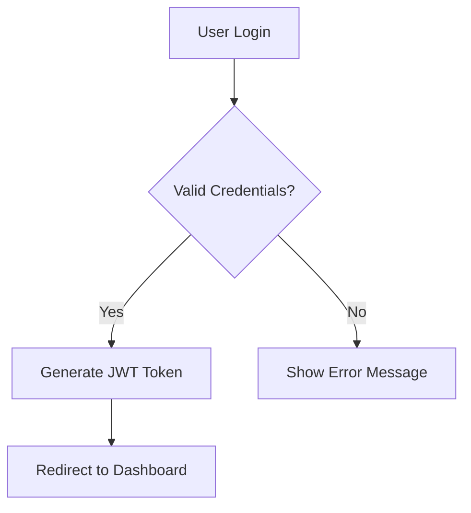

# Command: Write Human Documentation

> **IMPORTANT**: This command provides guidelines for LLMs to write documentation that reads naturally and avoids common AI writing patterns. Use this when creating or editing any documentation to ensure it sounds human-written and professional.

## Purpose

This command helps LLMs produce high-quality, human-like documentation by identifying and avoiding common AI writing patterns. Based on extensive research of AI writing characteristics, this guide provides concrete rules and examples to make your documentation clear, concise, and natural.

## Quick Reference

- **Goal**: Write documentation that is indistinguishable from quality human writing
- **Key Principle**: Be direct, specific, and avoid flowery language
- **Red Flags**: Overuse of certain phrases, excessive formatting, promotional tone
- **Self-Check**: Review your text against the checklist before finalizing

## Prerequisites

Before using this command:

1. [ ] Understand the target audience and their expertise level
2. [ ] Know the specific purpose of the documentation
3. [ ] Have access to source material or requirements
4. [ ] Be familiar with the project's existing documentation style

## Self-Check Checklist

Before finalizing any documentation, verify:

- [ ] No overuse of "delve," "crucial," "vital," "robust," "enhance," "leverage"
- [ ] No excessive use of em-dashes (—) or bold text
- [ ] No promotional language ("cutting-edge," "revolutionary," "game-changing")
- [ ] No vague importance claims ("plays a pivotal role," "underscores the significance")
- [ ] Sections don't end with "Challenges and Future Prospects"
- [ ] No "Rule of Three" patterns (three parallel items everywhere)
- [ ] Active voice preferred over passive voice
- [ ] Specific facts over general statements
- [ ] No collaborative phrases ("Let's explore," "we can see")
- [ ] No emoji unless explicitly required by the project style

## Language & Tone Guidelines

### ❌ AVOID: Undue Emphasis on Symbolism

**Bad:**

```markdown
The logo represents the company's commitment to innovation and symbolizes
the journey from idea to execution, embodying the core values of teamwork
and excellence.
```

**Good:**

```markdown
The logo was designed in 2019 by Jane Smith and features the company's
primary colors: blue and green.
```

**Rule:** State facts. Avoid interpreting symbolism or deeper meaning unless directly sourced.

---

### ❌ AVOID: Promotional Language

**Bad:**

```markdown
This revolutionary platform leverages cutting-edge technology to deliver
game-changing solutions that empower users to achieve unprecedented results.
```

**Good:**

```markdown
This platform uses React and Node.js to provide real-time data processing.
It was released in March 2023 and currently has 10,000 active users.
```

**Rule:** Use neutral, factual language. Avoid marketing superlatives.

---

### ❌ AVOID: Editorializing

**Bad:**

```markdown
It's important to note that this feature significantly enhances user
experience and plays a crucial role in the application's success.
```

**Good:**

```markdown
This feature allows users to export data in CSV format. According to
user surveys, 73% use this feature weekly.
```

**Rule:** Present facts with sources. Don't add subjective importance judgments.

---

### ❌ AVOID: Overuse of Certain Conjunctions

**Bad:**

```markdown
Additionally, the system provides logging. Furthermore, it includes
monitoring. Moreover, it supports alerts.
```

**Good:**

```markdown
The system provides logging, monitoring, and alerts.
```

**Rule:** Use simple connectors: "and," "but," "so," "because." Avoid: "moreover," "furthermore," "additionally," "hence," "thus."

---

### ❌ AVOID: Generic Section Summaries

**Bad:**

```markdown
In summary, this section explored the key concepts and their applications,
highlighting the importance of proper implementation.
```

**Good:**

```markdown
(Just end the section with the last substantial point)
```

**Rule:** Don't add meta-commentary about what you just wrote. End sections naturally.

---

### ❌ AVOID: "Challenges and Future Prospects" Conclusions

**Bad:**

```markdown
## Challenges and Future Prospects

While the technology shows promise, challenges remain including scalability
and adoption. Future developments may address these limitations.
```

**Good:**

```markdown
## Current Limitations

- Maximum 1000 concurrent connections (as of v2.1)
- No built-in caching (planned for v3.0, Q2 2024)
```

**Rule:** Be specific about limitations with versions/dates. Avoid vague future speculation.

---

### ❌ AVOID: Negative Parallelisms

**Bad:**

```markdown
The challenges include not only technical complexity but also resource
constraints. This affects not just development but also deployment.
```

**Good:**

```markdown
The main challenges are:

1. Technical complexity (requires senior developers)
2. Resource constraints (minimum 16GB RAM)
```

**Rule:** Use simple lists. Avoid "not only...but also" and "not just...but" patterns.

---

### ❌ AVOID: Forced Rule of Three

**Bad:**

```markdown
This enhances performance, improves reliability, and increases efficiency.
The system is fast, scalable, and secure.
Benefits include cost savings, time efficiency, and improved outcomes.
```

**Good:**

```markdown
This reduces response time by 40%. The system handles up to 10,000
requests per second and uses end-to-end encryption.
```

**Rule:** Use natural groupings. Don't force everything into groups of three.

---

### ❌ AVOID: Vague Attributions

**Bad:**

```markdown
Experts suggest that this approach is effective. It is widely regarded
as best practice. Many believe this is the optimal solution.
```

**Good:**

```markdown
According to the 2023 Stack Overflow Survey, 67% of developers prefer
this approach. The React documentation recommends this pattern.
```

**Rule:** Name specific sources or remove the claim.

---

### ❌ AVOID: Elegant Variation

**Bad:**

```markdown
First paragraph: "The database stores user information..."
Second paragraph: "The data repository maintains client details..."
Third paragraph: "The information storage system keeps customer records..."
```

**Good:**

```markdown
Use the same term consistently: "The database stores user data..."
```

**Rule:** Use consistent terminology. Don't vary terms just for variety.

---

## Style Guidelines

### ❌ AVOID: Excessive Title Case

**Bad:**

```markdown
## How To Configure The System For Production Deployment
```

**Good:**

```markdown
## How to configure the system for production deployment
```

**Rule:** Use sentence case for headings (only first word capitalized).

---

### ❌ AVOID: Excessive Boldface

**Bad:**

```markdown
The **configuration file** contains **several sections** including **database**,
**cache**, and **logging** settings. Each **section** has **specific parameters**.
```

**Good:**

```markdown
The configuration file contains several sections: database, cache, and
logging. Each section has specific parameters.
```

**Rule:** Use bold sparingly, only for emphasis on truly important terms.

**Exception:** Always preserve backticks for technical terms, code elements, constants, and boolean values in technical documentation:
- Code constants: `HEARTBEAT_TTL`, `FILES_CACHED`, `manifest.files`
- Boolean values: `pendingUpdate: true`, `hasUpdate: false`
- Technical variables: `timeSinceLastHeartbeat`, `lastHeartbeats`
- Function names: `client.navigate()`, `forceClientReload()`

---

### ❌ AVOID: Emoji (Unless Project Requires It)

**Bad:**

```markdown
## Getting Started 🚀

This guide will help you 📚 understand the basics ✨
```

**Good:**

```markdown
## Getting Started

This guide covers installation and basic usage.
```

**Rule:** Avoid emoji in technical documentation unless project style requires it.

---

### ❌ AVOID: Overuse of Em-Dashes

**Bad:**

```markdown
The system—which was developed in 2023—uses React—a popular framework—to
provide real-time updates—crucial for user experience.
```

**Good:**

```markdown
The system was developed in 2023. It uses React to provide real-time updates,
which improves user experience.
```

**Rule:** Use periods and commas. Save em-dashes for occasional parenthetical remarks.

---

### ❌ AVOID: Letter-Like Writing

**Bad:**

```markdown
Dear Reader,

I hope this guide finds you well. In this document, I will walk you
through the installation process. Thank you for your time and attention.

Best regards,
The Documentation Team
```

**Good:**

```markdown
## Installation

1. Download the installer from https://example.com/download
2. Run `npm install`
3. Configure the `.env` file
```

**Rule:** Write documentation, not letters. Be direct and procedural.

---

## Communication Guidelines

### ❌ AVOID: Collaborative Phrases

**Bad:**

```markdown
Let's explore how the authentication works. As we can see, the process
involves several steps. Let's examine each one carefully.
```

**Good:**

```markdown
The authentication process involves three steps:

1. User submits credentials
2. Server validates against database
3. Server returns JWT token
```

**Rule:** Don't address the reader directly. Just present the information.

---

### ❌ AVOID: Knowledge-Cutoff Disclaimers

**Bad:**

```markdown
Note: This information is current as of my last update in April 2024.
Please verify current details.
```

**Good:**

```markdown
(Include specific version numbers and dates within the content itself)
Version 2.1 was released on March 15, 2024.
```

**Rule:** Never mention your knowledge cutoff. Include dates in content naturally.

---

### ❌ AVOID: Placeholder Text

**Bad:**

```markdown
[More details to be added here]
[TODO: Add code example]
[Insert company name]
```

**Good:**

```markdown
(Either include the real content or remove the section)
```

**Rule:** Don't leave placeholder text. Complete the content or remove the section.

---

## Specific Phrases to Avoid

### High-Risk AI Phrases (Use Sparingly or Never)

1. **"delve into"** → Use: "examine," "explore," "discuss"
2. **"crucial"** → Use: "important," "necessary," "required"
3. **"vital"** → Use: "essential," "needed," "important"
4. **"robust"** → Use: "reliable," "stable," specific metrics
5. **"enhance"** → Use: "improve," specify the improvement
6. **"leverage"** → Use: "use," "utilize," "apply"
7. **"facilitate"** → Use: "enable," "allow," "make easier"
8. **"utilize"** → Use: "use"
9. **"implement"** → Often fine, but vary with "create," "build," "add"
10. **"comprehensive"** → Use: "complete," specify what it covers
11. **"innovative"** → Avoid, or cite specific innovation
12. **"cutting-edge"** → Avoid promotional language
13. **"state-of-the-art"** → Avoid promotional language
14. **"seamless"** → Specify the integration method
15. **"empower"** → Specify what users can do

### Overused Opening Patterns

❌ **Avoid:**

- "In today's digital landscape..."
- "In the realm of..."
- "When it comes to..."
- "It's important to note that..."
- "It's worth mentioning that..."
- "One of the key advantages is..."

✅ **Use:**

- Direct statements of fact
- Jump straight to the topic

**Bad:**

```markdown
In today's fast-paced development environment, it's important to note
that testing plays a crucial role in ensuring code quality.
```

**Good:**

```markdown
Testing prevents bugs from reaching production. This project uses Jest
for unit tests and Cypress for end-to-end tests.
```

---

## Practical Examples

### Example 1: API Documentation

**❌ Bad (AI-like):**

```markdown
## Overview

This comprehensive API empowers developers to seamlessly integrate our
cutting-edge authentication system into their applications. Leveraging
industry-standard protocols, it provides a robust and secure solution
that enhances user experience while maintaining the highest levels of
data protection.

### Key Features

- **Robust Security**: Utilizing advanced encryption
- **Seamless Integration**: Easy to implement
- **Comprehensive Documentation**: Detailed guides
```

**✅ Good (Human-like):**

```markdown
## Authentication API

This API handles user authentication using OAuth 2.0. It returns JWT
tokens valid for 24 hours.

### Endpoints

- `POST /auth/login` - Authenticate user
- `POST /auth/refresh` - Refresh token
- `POST /auth/logout` - Invalidate token

### Security

- Tokens use RS256 signing
- All endpoints require HTTPS
- Rate limit: 100 requests per hour per IP
```

---

### Example 2: Feature Description

**❌ Bad (AI-like):**

```markdown
## Export Feature

The export functionality represents a significant enhancement to the user
experience, enabling stakeholders to efficiently extract data in multiple
formats. This feature not only supports CSV and JSON but also provides
robust filtering capabilities, thus empowering users to customize their
exports according to their specific needs.
```

**✅ Good (Human-like):**

```markdown
## Export Data

Users can export data in CSV or JSON format.

To export:

1. Click "Export" in the top-right menu
2. Select format (CSV or JSON)
3. Choose columns to include (optional)
4. Click "Download"

Exports are limited to 10,000 rows. For larger datasets, use the API.
```

---

### Example 3: Tutorial Introduction

**❌ Bad (AI-like):**

```markdown
## Getting Started with Our Platform

Welcome! In this comprehensive guide, we'll delve into the fundamental
concepts that form the foundation of our platform. By the end of this
tutorial, you'll have gained a thorough understanding of the key features
and will be empowered to leverage the platform's capabilities to create
innovative solutions.

Let's embark on this exciting journey together!
```

**✅ Good (Human-like):**

```markdown
## Getting Started

This guide covers installation, basic configuration, and your first API call.

Prerequisites:

- Node.js 18 or higher
- npm 9 or higher
- Basic JavaScript knowledge

Time to complete: 15 minutes
```

---

## Common Issues and Solutions

| Issue                             | Solution                                                              |
| --------------------------------- | --------------------------------------------------------------------- |
| Text sounds too formal or flowery | Remove adjectives. Use simple, direct sentences.                      |
| Overuse of certain words          | Run a word frequency check. Vary vocabulary naturally.                |
| Too much emphasis (bold, italics) | Use formatting only for UI elements, code, or crucial warnings.       |
| Vague statements                  | Add specific numbers, dates, versions, or sources.                    |
| Promotional tone                  | Remove all marketing language. State facts neutrally.                 |
| Sections too long                 | Break into smaller sections. Use lists for multiple items.            |
| Overuse of passive voice          | Rewrite in active voice: "The system processes" not "is processed by" |

---

## Validation Process

After writing documentation, run these checks:

### 1. Phrase Detection

Search for these terms and review each usage:

- "delve," "crucial," "vital," "robust," "leverage," "enhance," "facilitate"
- "seamless," "innovative," "cutting-edge," "state-of-the-art"
- "Let's," "we can see," "it's important to note"

### 2. Pattern Check

- Count em-dashes (—). Should be < 2 per 100 words.
- Count bold text uses. Should be < 5% of text.
- Check for three-item lists in succession. Vary list lengths.

### 3. Structure Review

- No sections titled "Challenges and Future Prospects"
- No meta-commentary ("This section covered...")
- No promotional language in technical descriptions

### 4. Specificity Test

For each claim:

- Is there a specific number, date, or version?
- Is there a named source?
- If not, can you add one or should the claim be removed?

---

## Related Documents

- [Improve Instruction](mdc:commands/improve-instruction.md)
- [Documentation Guidelines](mdc:methodology/documentation-guidelines.md)
- [Create Command](mdc:commands/create-command.md)

---

## Additional Best Practices

### Technical Writing Standards

#### ✅ Use Clear and Concise Language

**Bad:**

```markdown
The agent should provide a detailed explanation of the process for initiating
a refund or replacement, ensuring that all necessary steps are communicated
clearly to the customer.
```

**Good:**

```markdown
Provide clear instructions on how to initiate a refund or replacement.
```

**Rule:** Use simple, direct sentences. Avoid complex structures and technical jargon.

---

#### ✅ Break Down Complex Tasks

**Bad:**

```markdown
If the customer requests a replacement, the customer service agent should
verify the product's eligibility for replacement, then proceed to provide
the customer with the appropriate return authorization form, which the
customer should complete and submit for approval by the customer service agent.
```

**Good:**

```markdown
To initiate a replacement:

1. Verify the product meets replacement requirements
2. Provide the customer with a return authorization form
3. Approve the form after the customer completes it
```

**Rule:** Use step-by-step instructions. Break complex processes into smaller tasks.

---

#### ✅ Include Real Examples

**Bad:**

```markdown
The system provides comprehensive error handling capabilities that enhance
the overall user experience and ensure reliable operation.
```

**Good:**

```markdown
Common error scenarios:

- Network timeout: Retry after 5 seconds
- Invalid credentials: Show "Login failed" message
- Server error: Display "Service temporarily unavailable"
```

**Rule:** Provide specific examples of common scenarios and their solutions.

---

### Testing and Improvement

#### ✅ Test Documentation with Users

**Process:**

1. Share documentation with different user groups
2. Collect feedback on unclear sections
3. Update documentation based on feedback
4. Verify improvements with follow-up testing

**Rule:** Always test documentation with actual users before finalizing.

---

#### ✅ Use Writing Tools

**Recommended tools:**

- **Grammarly**: Grammar and style checking
- **DeepL**: High-quality translation
- **Hemingway Editor**: Readability improvement
- **ProWritingAid**: Comprehensive writing analysis

**Rule:** Use AI-powered tools to improve grammar, style, and readability.

---

### Version Control and Collaboration

#### ✅ Maintain Documentation Versions

**Bad:**

```markdown
# API Documentation v1.0

Last updated: March 2024
```

**Good:**

```markdown
# API Documentation

## Version History

- v2.1 (2024-03-15): Added OAuth 2.0 support
- v2.0 (2024-01-10): Migrated to REST API
- v1.5 (2023-11-20): Added rate limiting
```

**Rule:** Track changes systematically. Include version numbers and dates.

---

#### ✅ Use Collaborative Tools

**Recommended platforms:**

- **GitBook**: Version-controlled documentation
- **Notion**: Team collaboration
- **Confluence**: Enterprise documentation
- **GitHub Wiki**: Developer-focused docs

**Rule:** Choose tools that support team collaboration and feedback.

---

### Accessibility and Standards

#### ✅ Ensure Accessibility

**Requirements:**

- Use alt text for images
- Provide screen reader compatibility
- Use proper heading hierarchy
- Ensure color contrast compliance

**Example:**

```markdown


## Login Process

1. Enter your username in the first field
2. Enter your password in the second field
3. Click the "Sign In" button
```

**Rule:** Make documentation accessible to users with disabilities.

---

#### ✅ Follow International Standards

**Standards to consider:**

- **ISO/IEC 26514**: Software user documentation
- **IEEE 1063**: Software user documentation
- **Mozilla Developer Network**: Web documentation standards

**Rule:** Adhere to established international documentation standards.

---

### Security and Data Protection

#### ✅ Protect Sensitive Information

**Bad:**

```markdown
Example API key: sk-1234567890abcdef
Test password: admin123
```

**Good:**

```markdown
Example API key: sk-**_REDACTED_**
Test password: [Use your actual password]
```

**Rule:** Never include real credentials or sensitive data in examples.

---

#### ✅ Follow Company Policies

**Checklist:**

- [ ] No confidential information in examples
- [ ] Compliance with data protection policies
- [ ] Approval from security team if needed
- [ ] Regular review for policy compliance

**Rule:** Always follow company data handling and security policies.

---

## Advanced Techniques

### Visual Elements

#### ✅ Use Diagrams and Charts

**When to use:**

- Complex system architecture
- Process flows
- Data relationships
- User journey maps

**Tools:**

- **Mermaid**: Code-based diagrams
- **Draw.io**: Visual diagrams
- **Lucidchart**: Professional diagrams

**Example:**

````markdown

````

---

#### ✅ Use Tables for Data

**Bad:**

```markdown
The system supports various file formats including CSV, JSON, XML, and PDF.
Each format has different size limits and processing times.
```

**Good:**

```markdown
| Format | Max Size | Processing Time |
| ------ | -------- | --------------- |
| CSV    | 100MB    | 2-5 seconds     |
| JSON   | 50MB     | 1-3 seconds     |
| XML    | 25MB     | 3-7 seconds     |
| PDF    | 10MB     | 5-10 seconds    |
```

---

### Templates and Consistency

#### ✅ Create Documentation Templates

**Template structure:**

```markdown
# [Feature Name]

## Overview

Brief description of the feature.

## Prerequisites

- Requirement 1
- Requirement 2

## Steps

1. Step 1
2. Step 2
3. Step 3

## Examples

Code examples and use cases.

## Troubleshooting

Common issues and solutions.

## Related Documentation

Links to related docs.
```

**Rule:** Use consistent templates across all documentation.

---

## External References

- [Wikipedia: Signs of AI Writing](https://en.wikipedia.org/wiki/Wikipedia:Signs_of_AI_writing) - Comprehensive list of AI writing patterns
- [ISO/IEC 26514:2019](https://www.iso.org/standard/71520.html) - Software user documentation standard
- [Mozilla Developer Network Writing Style Guide](https://developer.mozilla.org/en-US/docs/MDN/Writing_guidelines/Writing_style_guide) - Web documentation standards

---

**Last Updated**: 2025-10-09
