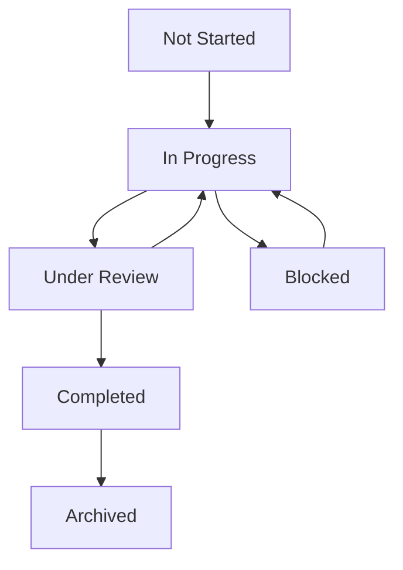

# Update Work Item Status Command

## Purpose

This command provides a standardized process for updating the status of work items in the Active Work Items Registry. It ensures consistent status tracking and proper documentation updates across the system.

## Prerequisites

- [ ] Access to the documentation repository
- [ ] Required permissions to modify documentation
- [ ] Understanding of work item statuses and their transitions
- [ ] Knowledge of the work item's current state and context

## Command Checklist

1. **Preparation**:

   - [ ] Get current date using `date +%Y-%m-%d`
   - [ ] Verify work item exists in Active Work Items Registry
   - [ ] Check current status and available transitions
   - [ ] Review related documents and dependencies

2. **Status Update**:

   - [ ] Update status in the work item document
   - [ ] Update last modified date
   - [ ] Update Active Work Items Registry entry
   - [ ] Update related metrics and statistics

3. **Dependency Check**:

   - [ ] Review items that depend on this work item
   - [ ] Update dependent items' statuses if needed
   - [ ] Update dependencies graph if needed

4. **Documentation Updates**:

   - [ ] Update CHANGELOG.md with status change
   - [ ] Update any relevant summary documents
   - [ ] Update documentation map if needed

5. **Validation**:
   - [ ] Run documentation validation
   - [ ] Fix any broken links or references
   - [ ] Verify all updates are consistent

## Status Transitions

### Available Statuses

- **Not Started**: Initial state for newly created items
- **In Progress**: Work has begun on the item
- **Under Review**: Item is being reviewed
- **Blocked**: Progress is blocked by dependencies or issues
- **Completed**: Work is finished but not yet archived
- **Archived**: Item has been moved to archives

### Valid Transitions



## Status Update Rules

1. **Not Started → In Progress**:

   - Verify all prerequisites are met
   - Ensure dependencies are available
   - Update start date

2. **In Progress → Under Review**:

   - Complete all required work
   - Prepare for review
   - Assign reviewers

3. **Under Review → In Progress**:

   - Document review feedback
   - Create action items for changes

4. **Under Review → Completed**:

   - Verify all requirements met
   - Get final approval
   - Update completion date

5. **Any Status → Blocked**:

   - Document blocking issues
   - Identify dependencies
   - Create action plan

6. **Completed → Archived**:
   - Verify no pending references
   - Update all dependencies
   - Move to archive location

## Examples

### Updating Task Status

```bash
# Check current status
npm run docs:check-item-status --id task-2025-03-documentation-automation

# Update status
npm run docs:update-status --id task-2025-03-documentation-automation --status "Under Review"

# Verify update
npm run docs:validate-status-update
```

### Marking Item as Blocked

```bash
# Update status with blocking reason
npm run docs:update-status --id proposal-redux-to-zustand-migration --status "Blocked" --reason "Waiting for performance analysis"

# Add blocking information
npm run docs:add-blocking-info --id proposal-redux-to-zustand-migration --blocker "task-2025-03-performance-analysis"
```

## Common Issues and Solutions

1. **Inconsistent Status**:

   - Run validation scripts
   - Check all related documents
   - Update all references

2. **Missing Dependencies**:

   - Review dependencies graph
   - Update missing references
   - Add required links

3. **Invalid Transitions**:
   - Check valid transition paths
   - Document reason for unusual transition
   - Get approval if needed

## References

- [Active Work Items Registry](../workflows/status.md)
- [Documentation Map](../navigation/documentation-map.md)
- [Task Archiving Rules](../rules/task-archiving-rules.md)
- [Documentation Guidelines](../methodology/documentation-guidelines.md)

---

**Last Updated**: 2025-03-13
