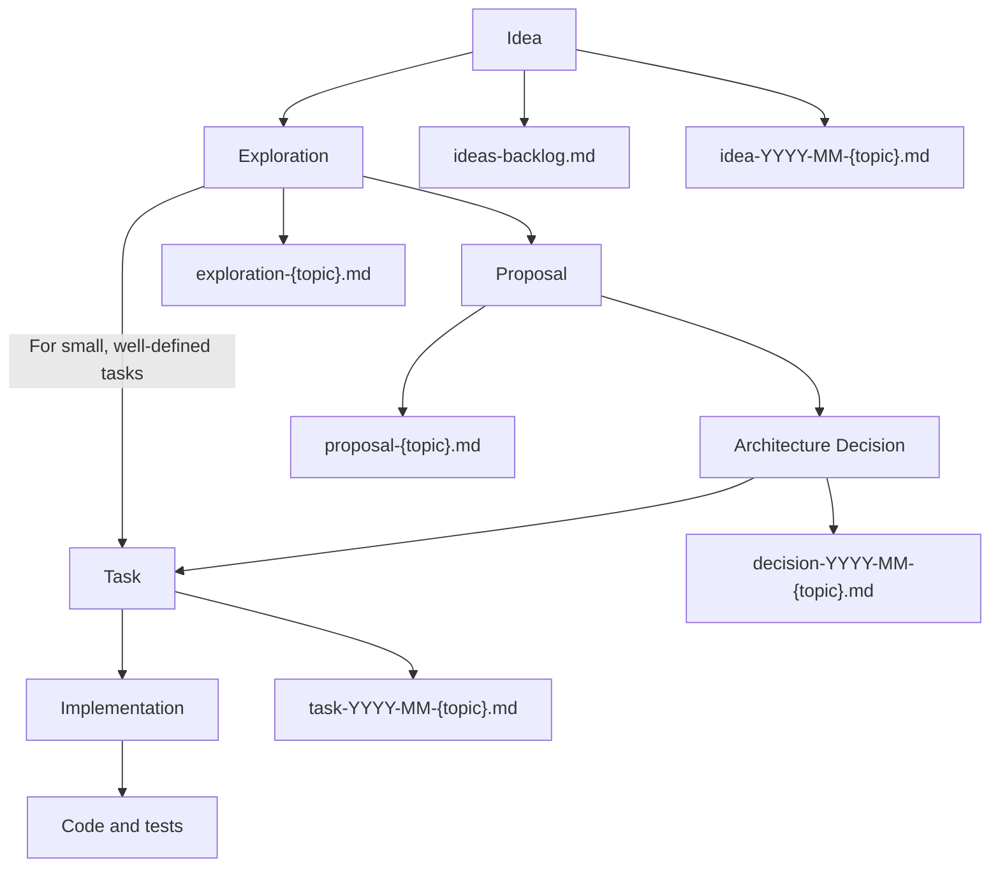

# Workflow: From Idea to Implementation

## Overview

This document describes the complete process of transforming ideas into code in the project, including all intermediate stages and artifacts. The purpose of this workflow is to provide a structured approach to developing ideas and transforming them into quality, well-documented, and implemented features.

## General Process Diagram

## Process Stages

### 1. Ideas

**Purpose**: Capturing initial ideas, concepts, and thoughts for further analysis.

**Key Artifacts**:

- `docs/ideas/ideas-backlog.md` - central registry of all ideas
- `docs/ideas/idea-YYYY-MM-{topic}.md` - individual documents for each idea

**Process**:

1. Record the idea in the ideas registry with a unique ID
2. Create a separate idea document using the template
3. Identify necessary research to evaluate the idea
4. Classify the idea by category, priority, and complexity

**State After Completion**:

- Documented idea with a clearly defined problem
- Preliminary description of a possible solution
- List of necessary research
- Identified stakeholders

### 2. Explorations

**Purpose**: Analysis and research of the idea to determine its viability, technical feasibility, and effort estimation.

**Key Artifacts**:

- `docs/ideas/explorations/exploration-{topic}.md` - documents with research results

**Process**:

1. Define key questions for research
2. Conduct necessary analysis, testing, prototyping
3. Document findings and conclusions
4. Form recommendations for further actions
5. Determine whether to proceed with a formal proposal or move directly to task creation

**State After Completion**:

- Detailed analysis of technical feasibility and limitations
- Effort estimation for implementation
- Recommendations for the best approach to implementation
- Prototypes or POCs (if necessary)
- Decision on next steps (proposal or direct to task)

### 3. Proposals

**Purpose**: Formalization of the idea in the form of a detailed proposal with technical details and an implementation plan.

**Key Artifacts**:

- `docs/proposals/proposal-{topic}.md` - documents with formal proposals

**Process**:

1. Transform the idea and research results into a proposal
2. Describe the technical solution in detail
3. Define success criteria and metrics
4. Assess the impact on the existing architecture
5. Get feedback from stakeholders

**State After Completion**:

- Complete description of the technical solution
- Implementation plan
- Acceptance criteria
- Risk assessment and mitigation strategies

### 4. Architecture Decisions

**Purpose**: Documentation of key architectural decisions and their justification.

**Key Artifacts**:

- `docs/decisions/decision-YYYY-MM-{topic}.md` - documents with architectural decisions (ADRs)

**Process**:

1. Form an ADR based on the accepted proposal
2. Document context, decisions, and consequences
3. Record considered alternatives and reasons for their rejection
4. Ensure connection with other documentation

**State After Completion**:

- Documented architectural decisions
- Clear justification for the decisions made
- History of considered alternatives

### 5. Tasks

**Purpose**: Breaking down the proposal into specific tasks for implementation.

**Key Artifacts**:

- `docs/tasks/task-YYYY-MM-{topic}.md` - documents with task descriptions

**Process**:

1. Break down the proposal into logical work blocks (or use exploration results directly for simpler tasks)
2. Create task documents with detailed execution plans
3. Define dependencies between tasks
4. Establish completion criteria for each task

**State After Completion**:

- Detailed implementation plan
- Defined completion criteria
- Established metrics and quality checks

### 6. Implementation

**Purpose**: Embodiment of tasks into working code while adhering to quality standards.

**Key Artifacts**:

- Code and tests
- Updates to existing documentation

**Process**:

1. Code development according to tasks
2. Writing tests
3. Code review
4. Documentation updates
5. Deployment and monitoring

**State After Completion**:

- Implemented functionality
- Complete test coverage
- Up-to-date documentation
- Performance/quality monitoring in production

## Simplified Process for Small Tasks

Not all ideas require the full process from exploration to proposal to ADR. For small, well-defined tasks where the exploration has yielded:

1. A clear, unambiguous technical solution
2. Low implementation complexity (1-2 developer days)
3. Minimal architectural impact
4. Low risk to existing systems
5. Clear implementation examples in the exploration document

In such cases, teams may decide to move directly from exploration to task creation, bypassing the formal proposal and ADR stages. This decision should be documented in the exploration document's conclusion with justification.

### When to Use the Simplified Process

The decision to use the simplified process should be based on a careful assessment of:

- **Complexity**: Is the implementation straightforward with few unknowns?
- **Scope**: Is the scope clearly defined and limited?
- **Dependencies**: Are there minimal dependencies on other components?
- **Risk**: Is the risk of implementation low with clear rollback options?
- **Consensus**: Is there team consensus on the approach?

If the answer to all these questions is "yes," the team can document this decision in the exploration conclusion and proceed directly to task creation.

## Additional Artifacts and Stages

Depending on the nature of the idea and project, additional artifacts may be used:

- **UX/UI Concepts**: design mockups, wireframes, prototypes
- **Analytics Data**: metrics, A/B tests, user surveys
- **Risk Assessment**: formal risk analysis and mitigation plan
- **Technical Specifications**: detailed API specifications, data schemas
- **Training Materials**: guides, documentation for end users

## Progress Tracking

For tracking process progress, the following are used:

1. **Document Statuses**: each document has a status that reflects its current state
2. **Checklists**: each stage has checklists with specific steps
3. **Progress Bars**: visual representation of progress for each task

## Roles and Responsibilities

| Role            | Responsibilities                               |
| --------------- | ---------------------------------------------- |
| **Idea Author** | Formulation of the initial idea and problem    |
| **Researcher**  | Conducting necessary research and analysis     |
| **Architect**   | Forming proposals and architectural decisions  |
| **Planner**     | Breaking down the proposal into specific tasks |
| **Developer**   | Implementing tasks in the form of code         |
| **Tester**      | Verifying implementation quality               |
| **Documentor**  | Maintaining up-to-date documentation           |

## Complete Cycle Example

Consider the idea "Component System for Data Caching":

1. **Idea**: Document `idea-2025-03-caching-system.md` is created and an entry is added to `ideas-backlog.md`
2. **Exploration**: Analysis of performance of different caching approaches is conducted, results are recorded in `exploration-caching-system.md`
3. **Decision Point**: Based on complexity assessment:
   - For complex implementation: Proceed to proposal
   - For simple, well-defined implementation: Go directly to task
4. **Proposal**: (If needed) Based on research, `proposal-caching-system.md` is formed with a detailed technical solution
5. **Decision**: (If needed) Key architectural decisions are recorded in `decision-2025-04-caching-system.md`
6. **Tasks**: The proposal (or exploration for simpler cases) is broken down into tasks `task-2025-04-caching-system-core.md`, `task-2025-04-caching-system-integration.md`, etc.
7. **Implementation**: Development of code, tests, and documentation updates

## Approach Benefits

- **Knowledge Preservation**: Each stage and decision is documented for future developers
- **Process Transparency**: Clear path from idea to implementation
- **Effective Planning**: Structured approach reduces risks and improves estimates
- **Decision Quality**: Through thorough research and analysis of alternatives
- **Collaboration**: Involving all stakeholders at the right stages
- **Flexibility**: Adapting the process to the task complexity (full process vs. simplified)

## Related Documents

- [Idea Template](../templates/idea-template.md)
- [Exploration Template](../templates/exploration-template.md)
- [Documentation Map](../navigation/documentation-map.md)
- [Ideas Backlog](../ideas/ideas-backlog.md)
- [Complete Exploration](../commands/complete-exploration.md)

---

**Last Update**: 2025-03-12

## References

- [Create Exploration](../commands/create-exploration.md)
- [Create Idea](../commands/create-idea.md)
- [Create Proposal](../commands/create-proposal.md)
- [Documentation Structure](../navigation/documentation-structure.md)
